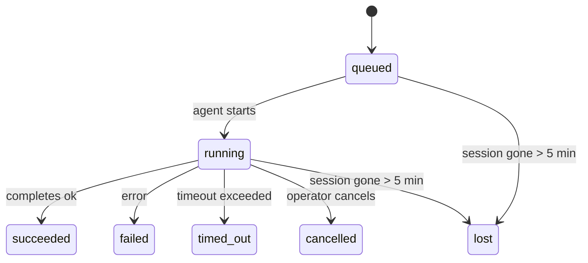

# OpenClaw vs 当前项目定时任务机制对比分析

## 一、核心架构对比

### OpenClaw 的三层数据

```
┌─────────────────────────────────────────────────────────┐
│                    Heartbeat (心跳)                     │
│  • 定期运行 main session                                 │
│  • 读取 HEARTBEAT.md                                      │
│  • LLM 自主决策是否需要执行任务                            │
│  • 不创建 background task 记录                            │
└─────────────────────────────────────────────────────────┘
                          ↓
┌─────────────────────────────────────────────────────────┐
│                      Cron (调度器)                       │
│  • 独立的调度器（基于 croniter）                          │
│  • 支持 at/every/cron 表达式                              │
│  • 创建 background task 记录                             │
│  • 支持 isolated session                                 │
└─────────────────────────────────────────────────────────┘
                          ↓
┌─────────────────────────────────────────────────────────┐
│                Background Tasks (任务记录)                │
│  • 跟踪所有后台工作                                        │
│  • 状态机: queued → running → terminal                   │
│  • 7天自动清理                                            │
└─────────────────────────────────────────────────────────┘
```

### 当前项目的双层结构

```
┌─────────────────────────────────────────────────────────┐
│              HeartbeatService (心跳服务)                  │
│  • 基于 HEARTBEAT.md 文件                                 │
│  • 动态调度（精确等待到下次执行时间）                       │
│  • 通过 Agent 执行任务                                     │
│  • 推送到消息通道                                          │
└─────────────────────────────────────────────────────────┘
                          ↓
┌─────────────────────────────────────────────────────────┐
│                 ReAct Agent (执行层)                      │
│  • 分析任务描述                                            │
│  • 调用工具执行                                            │
│  • 生成结果并推送                                          │
└─────────────────────────────────────────────────────────┘
```

## 二、详细差异对比

### 1. Heartbeat 机制

| 特性 | OpenClaw | 当前项目 |
|------|----------|----------|
| **实现语言** | TypeScript | Python |
| **存储方式** | HEARTBEAT.md (workspace context) | HEARTBEAT.md (文件) |
| **调度策略** | 固定间隔 (30m/1h) + activeHours | 动态调度（精确到秒） |
| **任务解析** | 正则表达式 + tasks: 块 | 正则表达式（YAML格式） |
| **执行方式** | Main session turn | 通过 Agent.analyze() |
| **响应协议** | HEARTBEAT_OK token | 无固定协议 |
| **会话管理** | isolatedSession 选项 | 用户专属 HeartbeatService |
| **任务记录** | 不创建 task 记录 | 不创建 task 记录 |

#### OpenClaw Heartbeat 特性

```typescript
// 1. 固定间隔 + activeHours
heartbeat: {
  every: "30m",           // 或 "1h" (OAuth模式)
  activeHours: {
    start: "09:00",
    end: "22:00",
    timezone: "Asia/Shanghai"
  }
}

// 2. tasks: 块支持（HEARTBEAT.md）
tasks:
  - name: inbox-triage
    interval: 30m
    prompt: "Check for urgent unread emails"

// 3. HEARTBEAT_OK 协议
if (nothing needs attention) {
  return "HEARTBEAT_OK";  // 会被自动抑制
}
```

#### 当前项目 Heartbeat 特性

```python
# 1. 动态调度（精确等待）
next_wake_ms = self._get_next_wake_ms(all_tasks)
delay_ms = max(0, next_wake_ms - now_ms)
await asyncio.sleep(delay_ms / 1000)

# 2. YAML 格式任务
- name: 每日空气质量报告
  schedule: "0 9 * * *"
  description: 发送广州空气质量日报
  enabled: true
  channels: ["weixin"]
  next_run_at: "2026-04-28T21:57:00+08:00"

# 3. 用户隔离
user_id = f"{channel}:default:{chat_id}"
heartbeat = await user_heartbeat_manager.get_user_heartbeat(user_id)
```

### 2. Cron 机制

OpenClaw 有独立的 Cron 系统，当前项目**没有独立的 Cron 系统**。

| 特性 | OpenClaw | 当前项目 |
|------|----------|----------|
| **实现** | 独立的 Cron 服务 | 无（依赖 Heartbeat） |
| **调度表达式** | at/every/cron (croner) | HeartbeatService 使用 croniter |
| **任务类型** | main/isolated/current/custom | 只有 HeartbeatService |
| **会话隔离** | isolated session (fresh) | 用户专属 session |
| **任务记录** | 创建 background task | 无任务记录系统 |
| **CLI 支持** | `openclaw cron add/list/show` | 无 CLI |

#### OpenClaw Cron 特性

```bash
# One-shot reminder
openclaw cron add \
  --name "Reminder" \
  --at "2026-02-01T16:00:00Z" \
  --session main \
  --system-event "Reminder: check the docs" \
  --wake now \
  --delete-after-run

# Recurring isolated job
openclaw cron add \
  --name "Daily report" \
  --cron "0 9 * * *" \
  --session isolated \
  --message "Generate daily report" \
  --announce --channel telegram
```

### 3. Background Tasks (任务记录)

OpenClaw 有完整的任务记录系统，当前项目**没有**。

| 特性 | OpenClaw | 当前项目 |
|------|----------|----------|
| **任务来源** | ACP/Subagent/Cron/CLI | 无 |
| **状态机** | queued→running→succeeded/failed/timed_out/cancelled/lost | 无 |
| **数据持久化** | SQLite (tasks.db) | 无 |
| **自动清理** | 7天后删除 | 无 |
| **CLI 支持** | `openclaw tasks list/show/cancel/audit` | 无 |
| **完成通知** | Push to channel or heartbeat | 无 |

#### OpenClaw Task 生命周期



## 三、关键差异总结

### 1. 设计哲学

**OpenClaw**：
- **关注点分离**：Heartbeat（定期检查）、Cron（精确调度）、Tasks（任务记录）各司其职
- **LLM 自主决策**：Heartbeat 让 LLM 决定是否需要执行任务
- **多种执行模式**：main session / isolated session / custom session
- **完整的任务跟踪**：所有后台工作都有记录

**当前项目**：
- **统一调度**：HeartbeatService 既负责调度又负责执行
- **工具驱动**：Agent 通过工具（如 schedule_task）创建任务
- **用户隔离**：每个用户有专属的 HeartbeatService 实例
- **无任务记录**：执行后直接推送，不保留记录

### 2. 适用场景

**OpenClaw 适合**：
- 复杂的多用户系统
- 需要精确调度（cron 表达式）
- 需要任务跟踪和审计
- 多种执行模式（isolated session 等）
- CLI 交互

**当前项目适合**：
- 单一社交模式（微信/QQ等）
- 用户专属定时任务
- 轻量级定时推送
- 不需要复杂的任务跟踪

### 3. 技术栈

| 层级 | OpenClaw | 当前项目 |
|------|----------|----------|
| **语言** | TypeScript | Python |
| **调度库** | croner | croniter |
| **存储** | JSON (jobs.json) + SQLite (tasks.db) | JSON (HEARTBEAT.md) |
| **会话管理** | 复杂的 session key 系统 | 用户 ID (channel:bot:user) |
| **CLI** | 自研 CLI | 无 CLI |

## 四、当前项目的问题与改进建议

### 问题 1: 正则表达式解析不稳定 ✅ 已修复

**问题**：多行 description 导致 next_run_at 解析失败

**修复**：
```python
# 修复前
task_pattern = r'...description:\s*(.+?)\s+enabled:...'

# 修复后
task_pattern = r'...description:\s*([\s\S]+?)\s+enabled:...(?:[\s\S]*?next_run_at:...)'
```

### 问题 2: 缺少独立的 Cron 系统

**建议**：
- 保持 HeartbeatService 用于简单的用户定时任务
- 如果需要更复杂的调度（如一次性提醒、精确时间），可以参考 OpenClaw 实现独立的 Cron 服务

### 问题 3: 缺少任务记录系统

**建议**：
- 添加 TaskRecord 模型（参考 OpenClaw 的 background tasks）
- 记录任务执行历史：queued → running → succeeded/failed
- 支持任务查询和审计

### 问题 4: 缺少 CLI 支持

**建议**：
- 添加 CLI 命令：
  ```bash
  python -m app.cli.heartbeat list
  python -m app.cli.heartbeat show <task_id>
  python -m app.cli.heartbeat cancel <task_id>
  ```

### 问题 5: 缺少多种执行模式

**建议**：
- 参考 OpenClaw 的 isolated session 概念
- 支持不同的执行上下文（轻量级上下文、独立会话等）

## 五、代码示例对比

### OpenClaw Heartbeat Runner

```typescript
// src/infra/heartbeat-runner.ts

async function runHeartbeat(): Promise<HeartbeatRunResult> {
  // 1. 检查 activeHours
  if (!isWithinActiveHours(config.heartbeat.activeHours)) {
    return { skipped: true, reason: 'outside-active-hours' };
  }

  // 2. 解析 HEARTBEAT.md 中的 tasks: 块
  const heartbeatTasks = parseHeartbeatTasks(heartbeatContent);
  const dueTasks = heartbeatTasks.filter(isTaskDue);

  // 3. 如果没有到期任务，跳过
  if (dueTasks.length === 0) {
    return { skipped: true, reason: 'no-tasks-due' };
  }

  // 4. 构建提示词（只包含到期任务）
  const prompt = buildHeartbeatPrompt(dueTasks);

  // 5. 运行 Agent
  const result = await runAgentTurn(prompt);

  // 6. 处理 HEARTBEAT_OK
  if (isHeartbeatContentEffectivelyEmpty(result)) {
    return { skipped: true, reason: 'heartbeat-ok' };
  }

  // 7. 更新任务时间戳
  updateTaskTimestamps(dueTasks);

  return { delivered: true, content: result };
}
```

### 当前项目 HeartbeatService

```python
# app/social/heartbeat_service.py

async def _tick(self) -> None:
  # 1. 读取 HEARTBEAT.md
  content = self.heartbeat_file.read_text(encoding='utf-8')
  all_tasks = self._parse_tasks(content)

  # 2. 筛选到期任务
  current_time = datetime.now(self.timezone)
  due_tasks = []
  for task in all_tasks:
      next_run_str = task.get("next_run_at")
      if next_run_str:
          next_run = datetime.fromisoformat(next_run_str.replace("Z", "+00:00"))
          if current_time >= next_run:
              due_tasks.append(task)

  # 3. 执行任务
  if self.on_execute and due_tasks:
      result = await self.on_execute(due_tasks)

      # 4. 发送通知
      if self.on_notify and result.get("should_notify"):
          await self.on_notify(result)

  # 5. 更新 next_run_at
  for task in all_tasks:
      next_run = self._compute_next_run(task["schedule"], current_time)
      task["next_run_at"] = next_run.isoformat()
  self._update_task_next_runs(all_tasks)
```

## 六、总结

### OpenClaw 的优势

1. **关注点分离**：Heartbeat/Cron/Tasks 各司其职
2. **灵活性**：多种执行模式、多种调度方式
3. **可观测性**：完整的任务记录和审计
4. **CLI 友好**：丰富的命令行工具

### 当前项目的优势

1. **简单直接**：统一的服务，易于理解
2. **用户隔离**：天然支持多用户
3. **动态调度**：精确等待到下次执行时间
4. **Python 生态**：与 ReAct Agent 无缝集成

### 改进方向

1. ✅ **修复正则表达式**（已完成）
2. 添加任务记录系统（参考 OpenClaw 的 background tasks）
3. 添加 CLI 支持
4. 支持多种执行模式（isolated session 等）
5. 改进错误处理和日志记录

## 七、附录：OpenClaw 核心文件

```
src/
├── infra/
│   ├── heartbeat-runner.ts          # Heartbeat 执行器
│   ├── heartbeat-schedule.ts        # 调度逻辑
│   ├── heartbeat-events.ts          # 事件系统
│   └── heartbeat-wake.ts            # 唤醒机制
├── cron/
│   ├── service.ts                   # Cron 服务
│   └── isolated-agent/              # Isolated session
├── auto-reply/
│   ├── heartbeat.ts                 # Heartbeat 解析
│   └── heartbeat-reply-payload.ts   # 回复处理
└── cli/
    ├── cron-cli.ts                  # Cron CLI
    └── tasks-cli.ts                 # Tasks CLI
```
