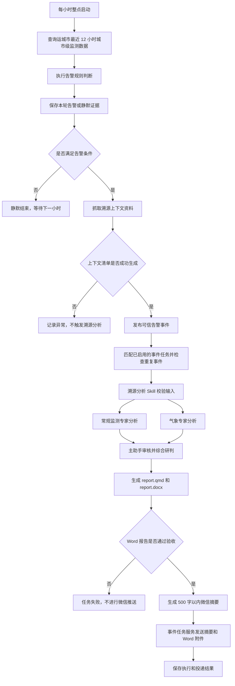

# 运城市告警快速溯源定时任务说明

## 1. 文档用途

本文面向驻场人员、业务管理人员和项目负责人，介绍运城市空气质量小时告警快速溯源定时任务的完整业务流程，包括：

- 每小时空气质量检查与告警判断；
- 告警证据留存和溯源资料抓取；
- 溯源分析 Skill 的专业研判流程；
- 报告生成、验收和微信投递；
- 异常情况处理及业务结论边界。

本文描述当前正式运行链路，不涉及济宁每日快速溯源任务，也不采用早期“定时扫描最新证据目录”的旧流程。

## 2. 任务要解决什么问题

任务持续关注运城市空气质量变化。当污染物在短时间内快速上升、AQI 进入污染水平，或污染物连续处于高值时，系统自动准备监测、气象、轨迹、火点和预报资料，组织专业分析并向驻场团队发送报告。

整个流程重点回答以下业务问题：

1. 运城市是否出现需要关注的空气质量变化？
2. 污染从何时开始、目前处于上升、持续还是缓解阶段？
3. 本地累积、区域传输、气象条件或其他因素是否提供了研判线索？
4. 未来数小时是否仍存在风险？
5. 驻场团队应在什么时间、什么范围开展哪些核查和盯守工作？

## 3. 任务概览

### 3.1 执行频率

- 调度周期：每小时执行一次。
- Cron 表达式：`0 * * * *`，即每个小时整点运行。
- 监测范围：当前仅检查运城市城市级小时空气质量数据。
- 默认回看窗口：最近 12 小时。

### 3.2 端到端流程



## 4. 第一阶段：小时数据检查

每小时整点，系统以当前整点作为本轮查询结束时间，向前查询最近 12 小时的运城市城市级空气质量数据。每条数据包括时间、AQI、空气质量等级、首要污染物，以及 PM2.5、PM10、O3、NO2、SO2、CO 等污染物浓度。

系统按时间顺序整理数据，以最新一条、三条记录前的数据和最近三条记录作为告警判断依据。

如果有效记录少于 4 条，无法判断约三小时内的变化幅度，本轮按“数据不足”处理：保存静默记录，不触发后续溯源分析，下一小时继续检查。

## 5. 第二阶段：告警判断

### 5.1 主告警规则

以下任一规则命中即可触发告警：

| 类型 | 关注指标 | 判断条件 | 业务含义 |
| --- | --- | --- | --- |
| 快速上升 | O3 | 最新值比三条记录前升高 40 μg/m³ 及以上 | 臭氧短时明显抬升，需关注光化学生成风险 |
| 快速上升 | PM2.5 | 最新值比三条记录前升高 25 μg/m³ 及以上 | 细颗粒物快速累积，需关注本地累积、传输或燃烧影响 |
| 快速上升 | PM10 | 最新值比三条记录前升高 40 μg/m³ 及以上 | 粗颗粒物快速上升，需结合风场、扬尘和降水研判 |
| AQI 进入污染水平 | AQI | 最新 AQI 严格大于 100 | 空气质量进入轻度污染及以上盯守范围 |
| 连续高值 | O3 | 最近三条记录均达到 160 μg/m³ 及以上 | 臭氧持续处于关注水平 |
| 连续高值 | PM2.5 | 最近三条记录均达到 75 μg/m³ 及以上 | 细颗粒物持续处于关注水平 |
| 连续高值 | PM10 | 最近三条记录均达到 150 μg/m³ 及以上 | 可吸入颗粒物持续处于关注水平 |
| 连续高值 | NO2 | 最近三条记录均达到 100 μg/m³ 及以上 | 二氧化氮持续处于关注水平 |
| 连续高值 | CO | 最近三条记录均达到 2.0 mg/m³ 及以上 | 一氧化碳持续处于关注水平 |

需要注意：AQI 是综合空气质量指数，`AQI > 100` 不等于某一种污染物浓度超过 100。后续研判必须结合首要污染物和分项污染物变化。

### 5.2 辅助研判线索

以下规则只提供分析方向，不能单独触发告警：

| 变化特征 | 判断条件 | 提示方向 |
| --- | --- | --- |
| PM2.5 与 PM10 同步上升 | PM2.5 上升 15 μg/m³ 及以上，且 PM10 上升 40 μg/m³ 及以上 | 颗粒物共同累积、扬尘或传输线索 |
| PM2.5 与 CO 同步上升 | PM2.5 上升 15 μg/m³ 及以上，且 CO 上升 0.2 mg/m³ 及以上 | 不完全燃烧等影响线索 |
| NO2 上升、O3 下降 | NO2 上升 20 μg/m³ 及以上，且 O3 下降 | 局地氮氧化物影响线索 |
| NO2 与 O3 同步上升 | NO2 上升 20 μg/m³ 及以上，且 O3 上升 | 前体物累积叠加光化学生成风险线索 |

这些线索用于确定后续资料关注重点，不能直接用于确认污染来源。

### 5.3 告警判断结果

无主告警规则命中时：

- 保存 `has_alert=false`、`status=silent` 的检查结果；
- 不抓取溯源上下文；
- 不发布告警事件；
- 不生成或推送溯源报告。

至少一条主告警规则命中时：

- 保存 `has_alert=true`、`status=pending_trace` 的告警结果；
- 记录告警时间、告警原因、规则依据和辅助线索；
- 立即进入溯源资料抓取阶段。

如果多条主规则同时命中，系统会保留全部命中规则，并以第一条主规则对应的指标作为本次重点污染物。Skill 后续只校验输入一致性，不会重新计算或推翻告警。

## 6. 第三阶段：证据留存

系统每小时都会创建独立证据目录，避免新结果覆盖旧结果。目录格式为：

```text
backend/backend_data_registry/scenarios/yuncheng_trial/{YYYYMM}/{YYYYMMDD_HHMMSS}/
```

其中，`YYYYMMDD_HHMMSS` 是本轮实际完成告警检查的时间。

每轮至少生成：

- `{YYYYMMDD_HHMMSS}_alert.json`：本轮告警或静默判断结果。

有告警时还会在同一目录中保存：

- `tracing_context_manifest.json`：本轮上下文资产清单、缺失资料和抓取错误；
- 监测、气象、轨迹、火点及预报数据和图片；
- `weather_analysis_draft.md`：气象专家草稿；
- `routine_analysis_draft.md`：常规监测专家草稿；
- `report.qmd`：正式报告源文件；
- `report.docx`：对外发送的 Word 报告。

证据目录将告警依据、分析资料、专家草稿和最终报告关联在一起，便于后续复核和追溯。

## 7. 第四阶段：告警后数据抓取

有告警时，系统围绕“发生了什么、是否存在区域联动、天气是否有利于污染形成或传输、未来是否持续”自动准备以下资料。

| 资料类别 | 主要内容 | 业务用途 |
| --- | --- | --- |
| 运城市监测数据 | AQI、首要污染物和各污染物小时变化 | 建立污染过程主时间线，判断开始、加速、持续或缓解时段 |
| 周边城市监测数据 | 临汾、渭南、三门峡、洛阳、晋城同期数据 | 判断是否存在区域同步抬升和重点关注方向 |
| 城市污染物空间分布图 | 运城及周边城市目标污染物空间分布 | 直观展示区域差异和联动特征 |
| 历史气象数据 | 温度、湿度、风向、风速、降水等 | 判断静稳、高湿、高温、强辐射或降水清除条件 |
| 后向轨迹 | 到达运城气团此前经过的方向和轨迹图 | 提示潜在输送方向，并与风场、周边城市变化交叉验证 |
| 风场图 | 告警时段区域风向和风速 | 判断扩散和传输条件 |
| 能见度、降水、雷达和水汽图 | 能见度、降水实况与预报、雷达回波、可降水量 | 判断湿清除、天气过程和颗粒物累积条件 |
| 卫星火点 | 火点明细、摘要和分布图 | 提供周边燃烧或热异常活动线索 |
| 未来气象预报 | 未来 1—5 天风、温度、湿度和降水等 | 判断后续扩散、输送、清除和光化学生成条件 |
| 未来空气质量预报 | 未来 24 小时 AQI、首要污染物和相关污染物预测 | 判断风险是否延续，并安排后续加密盯守 |

### 7.1 资料时间要求

系统和分析人员必须使用资料的实际有效时间，而不是文件下载时间：

- 监测和气象实况按实际小时挂接；
- 后向轨迹按受体时刻挂接；
- 火点按卫星观测时间挂接；
- 图片按图中或元数据标注的有效时次挂接；
- 预报必须说明起报时间、预报时效和对应未来时间范围。

不同资料时间不一致时，应明确说明时间差，不能强行对齐。

### 7.2 资料缺失处理

单项资料抓取失败不会中止其他资料采集。系统会将缺失资产、失败原因和建议补证事项写入 `tracing_context_manifest.json`。

资料不完整时仍可继续研判，但必须：

- 降低相关判断的确定程度；
- 在报告中说明需要补充确认的信息；
- 不使用缺失资料支持业务结论。

只有 `tracing_context_manifest.json` 成功生成且文件真实存在时，系统才会发布正式告警事件并启动后续分析。

## 8. 第五阶段：溯源分析 Skill 流程

### 8.1 Skill 的职责

运城市告警溯源分析 Skill 负责组织专业分析、审核证据和生成报告。它不重新判断告警是否成立，只检查以下内容是否一致：

- 告警文件是否存在且状态为 `has_alert=true`、`status=pending_trace`；
- 上下文资产清单是否存在；
- 告警文件、上下文清单和证据目录是否属于同一轮任务；
- 报告输出目录是否就是本轮证据目录。

校验不通过时，Skill 返回失败结果，不生成成功报告。

### 8.2 常规监测专家

常规监测专家以运城市小时数据作为主时间轴，重点分析：

- 告警前后的 AQI 和污染物变化；
- 污染开始、加速、持续和最新变化；
- 周边城市是否同步抬升；
- 城市空间分布和火点是否提供提示性线索；
- 未来 24 小时空气质量风险；
- 驻场团队后续盯守和现场核查重点。

分析结果写入 `routine_analysis_draft.md`。

### 8.3 气象专家

气象专家将气象条件与污染时间线对照，重点分析：

- 告警前后风向、风速、温度、湿度和降水变化；
- 是否存在弱风、静稳、高温、强辐射、高湿或清除不足等条件；
- 后向轨迹和风场提示的潜在输送方向；
- 雷达、降水、水汽和能见度资料能否解释过程变化；
- 未来气象条件是否有利于扩散、清除或光化学生成；
- 哪些气象图片适合进入正式报告及其业务含义。

分析结果写入 `weather_analysis_draft.md`。

### 8.4 主助手审核整合

两个专家草稿完成后，主助手统一审核：

1. 检查监测时间、气象时间、轨迹受体时刻和预报时效是否准确。
2. 检查 AQI 是否被错误理解为单项污染物浓度。
3. 检查缺失资料是否已经说明。
4. 检查轨迹、火点和周边同步变化是否被过度解释。
5. 检查驻场建议是否包含明确时间窗、核查范围、现场动作和升级条件。
6. 如果两个专家意见冲突，明确写出证据不一致或不足，不强行形成统一结论。

随后，主助手以污染过程时间线为核心，将监测、周边城市、气象、轨迹、火点和预报资料整合为正式报告。

## 9. 第六阶段：报告出具

### 9.1 正式报告结构

报告面向业务人员，主要包含：

1. 本次告警概览；
2. 污染过程时间线；
3. 当前情况与未来趋势；
4. 可能影响因素；
5. 现场行动安排；
6. 需要补充确认的信息；
7. 附件与数据来源。

污染过程时间线是报告核心。每个时间节点重点回答：当时发生了什么、同期情况如何、对下一时段的盯守和行动意味着什么。

### 9.2 报告产物

| 产物 | 用途 |
| --- | --- |
| `report.qmd` | 正式报告源文件，保留文本、表格、图片和报告结构 |
| `report.docx` | 对外发送和业务归档的 Word 报告 |
| 500 字以内微信摘要 | 快速说明告警时间、污染物、等级、主要判断和行动建议 |

系统使用标准报告包能力保存、渲染并验收报告。`report.docx` 必须真实存在且通过验收，任务才能返回成功；Word 不存在或验收失败时，不允许只发送摘要或返回成功。

## 10. 第七阶段：事件处理和微信投递

### 10.1 事件触发

上下文清单准备完成后，小时盯守任务发布 `yuncheng.alert.created` 可信事件。事件中包含本轮告警文件、上下文清单和证据目录路径。

事件任务服务只执行同时满足以下条件的任务：

- 任务已启用；
- 触发类型为事件；
- 事件类型匹配；
- 城市等过滤条件匹配。

系统按“任务 ID + 事件 ID”进行幂等检查，同一任务不会重复处理同一告警事件。

### 10.2 接收人检查

开启微信投递的任务会在执行分析前检查接收人。只有处于启用状态且已绑定微信的目标用户才能接收报告。没有有效接收人时，本次事件任务直接失败，避免生成无人接收的广播任务。

### 10.3 投递内容

Skill 本身不直接调用微信。主助手只向事件任务服务返回：

- 500 字以内微信正文；
- `report.docx` 的绝对路径。

事件任务服务负责向有效微信用户发送摘要和 Word 附件，并将投递结果和事件上下文写入用户的社交主会话，便于后续查询和追溯。

## 11. 异常情况处理

| 情况 | 系统处理 | 业务影响 |
| --- | --- | --- |
| 小时数据少于 4 条 | 保存“数据不足”的静默结果 | 不告警、不分析，下一小时继续检查 |
| 无主告警规则命中 | 保存静默结果并结束 | 不抓取上下文、不生成报告、不推送 |
| 单项上下文资料抓取失败 | 记录缺失项和失败原因，继续抓取其他资料 | 可以继续研判，但相关结论必须降级并说明缺口 |
| 上下文清单未生成 | 不发布可信告警事件 | 本轮不进入 Skill 分析，需根据日志排查 |
| 没有匹配的事件任务 | 事件发布完成但无人执行 | 不生成报告、不推送 |
| 同一事件重复到达 | 幂等检查识别为重复，不再执行 | 避免重复报告和重复推送 |
| 没有有效微信接收人 | 事件任务标记失败 | 不进入正常投递闭环，需检查用户状态和微信绑定 |
| 告警文件或目录不一致 | Skill 返回失败 | 不生成成功报告 |
| 专家草稿缺失或分析失败 | Skill 返回失败 | 不生成或推送不完整报告 |
| Word 导出或验收失败 | 任务返回失败 | 不推送摘要和附件 |
| 个别接收人投递失败 | 保存每位接收人的投递结果 | 可根据执行记录对失败接收人进行重试 |

## 12. 业务结论边界

当前任务能够形成快速、提示性的来源研判，但不能替代现场核查和正式源解析。业务人员使用报告时必须遵守以下边界：

- 不确认具体污染源或责任主体；
- 不写“某企业导致本次污染”等确定性结论；
- 后向轨迹和风场只用于提示潜在输送方向；
- 周边城市同步变化只用于提示区域过程可能性；
- 卫星火点只用于提示燃烧或热异常线索，仍需现场巡查确认；
- 当前未接入运城市站点小时数据，不得形成站点异常或仪器质控结论；
- 当前未接入本地污染源清单、企业工况、门禁、卡口、移动源轨迹、走航和执法巡查数据；
- 报告应明确区分监测事实、气象提示、可能影响因素和需要补充确认的信息。

因此，报告中的结论应使用“监测显示”“资料提示”“可能存在”“现有证据不足以确认”“建议结合现场资料核实”等表述。

## 13. 驻场团队如何使用报告

收到报告后，驻场团队可按以下顺序开展工作：

1. 先确认告警时间、重点污染物和当前变化趋势。
2. 根据报告给出的时间窗安排未来 1—2 小时加密盯守。
3. 结合风向、轨迹和周边城市变化确定优先核查方向。
4. 按本地清单核查重点道路、工业片区、施工区域或燃烧活动线索。
5. 补充站点小时数据、企业工况、门禁、卡口、走航和执法巡查等本地资料。
6. 当 AQI 或重点污染物继续上升、周边城市同步恶化、静稳条件持续或输送方向进一步明确时，及时升级会商和现场核查。

任务的核心价值，是把每小时盯守、告警依据、分析资料、专业研判、行动建议和报告投递连接成一个可回溯的业务闭环。
