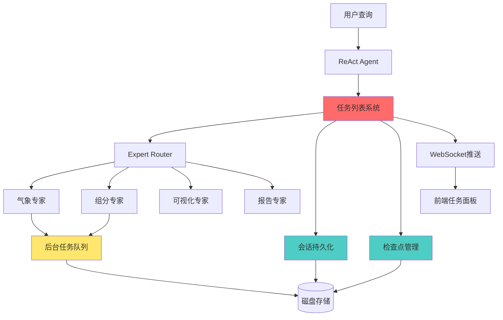

# 长任务连续性优化方案

## 文档信息
- **创建时间**: 2026-02-13
- **版本**: v1.0
- **状态**: 待实施
- **优先级**: 🔴 高

---

## 一、问题诊断

### 1.1 当前能力对比

| 能力维度 | Claude Code | 本项目 | 差距等级 |
|---------|-------------|--------|---------|
| **会话持久化** | ✅ 自动保存到文件 | ❌ 无 | 🔴 严重 |
| **任务追踪** | ✅ TaskList系统 | ⚠️ 仅内部状态 | 🔴 严重 |
| **断点恢复** | ✅ 读取文件+任务列表 | ❌ 无 | 🔴 严重 |
| **后台执行** | ✅ run_in_background | ❌ 阻塞式 | 🔴 严重 |
| **数据持久化** | ✅ 文件系统 | ✅ DataContextManager | 🟢 良好 |
| **上下文压缩** | ✅ 自动总结 | ✅ context_compressor | 🟢 良好 |
| **错误恢复** | ✅ 工具重试+回滚 | ✅ Reflexion+ReAsk | 🟢 良好 |
| **进度可见性** | ✅ 实时输出 | ⚠️ 仅流式日志 | 🟡 中等 |

### 1.2 核心痛点

#### 痛点1：会话易失性 🔴
**现象**：
```
用户: "综合分析广州O3污染溯源"
Agent执行流程:
  1. 获取气象数据 ✅ (2分钟)
  2. 获取VOCs数据 ✅ (1.5分钟)
  3. 计算PMF... 🔄 (用户刷新页面)
  4. 💥 所有进度丢失，需从头开始
```

**影响**：
- 用户体验极差（10分钟工作白费）
- 浪费计算资源（重复执行）
- 降低用户信任度

#### 痛点2：无后台任务支持 🔴
**现象**：
```python
# PMF计算耗时5-10分钟，阻塞主线程
calculate_pmf() →
  ↓
前端等待（显示loading）
  ↓
后端阻塞（无法处理其他请求）
  ↓
用户关闭页面 → 任务中止
```

**影响**：
- 前端长时间无响应
- 后端无法并发处理
- 用户无法执行其他操作

#### 痛点3：任务进度不透明 🔴
**现象**：
```
前端显示: "🔄 正在分析..."

用户无法了解:
  - 总共几个步骤？
  - 当前哪一步？
  - 已完成哪些？
  - 剩余多少？
```

**影响**：
- 用户焦虑（不知道要等多久）
- 无法判断是否卡死
- 出错后无法定位问题

---

## 二、优化方案设计

### 2.1 架构总览



### 2.2 核心模块

#### 模块1：任务列表系统 🔴🔴🔴
**优先级**：最高
**价值**：其他模块的基础

**功能**：
- 任务创建与状态管理
- 依赖关系追踪
- 进度计算
- 持久化存储
- 实时状态推送

**数据结构**：
```python
class Task:
    id: str                    # 任务ID
    session_id: str            # 会话ID
    subject: str               # 任务标题
    description: str           # 任务描述
    status: TaskStatus         # pending/in_progress/completed/failed/skipped
    progress: int              # 0-100
    depends_on: List[str]      # 依赖任务ID列表
    metadata: Dict             # 元数据（data_id、error等）
    created_at: datetime
    updated_at: datetime
```

#### 模块2：会话持久化系统 🔴🔴
**优先级**：高
**价值**：支持断点恢复

**功能**：
- 会话状态保存
- 会话恢复
- 会话列表管理
- 自动清理过期会话

**存储内容**：
```python
{
    "session_id": "abc123",
    "created_at": "2026-02-13T10:00:00",
    "updated_at": "2026-02-13T10:15:00",
    "query": "综合分析广州O3污染溯源",
    "conversation_history": [...],
    "task_list_ref": "abc123_tasks.json",
    "data_context": {
        "data_ids": ["weather_data:xyz", "vocs_data:abc"],
        "cache_keys": [...]
    },
    "current_step": "pmf_calculation",
    "metadata": {
        "user_id": "user123",
        "project": "air_pollution"
    }
}
```

#### 模块3：检查点管理系统 🔴
**优先级**：高
**价值**：细粒度断点恢复

**功能**：
- 关键步骤自动创建检查点
- 检查点恢复
- 检查点清理

**检查点类型**：
```python
CheckpointType = Literal[
    "data_loaded",        # 数据加载完成
    "analysis_started",   # 分析开始
    "analysis_completed", # 分析完成
    "visualization_done", # 可视化完成
    "report_generated"    # 报告生成完成
]
```

#### 模块4：后台任务队列 🔴
**优先级**：高
**价值**：支持长时间计算

**技术选型**：Celery + Redis

**异步工具列表**：
- `calculate_pmf` - PMF源解析（5-10分钟）
- `calculate_obm_ofp` - OBM/OFP分析（3-5分钟）
- `generate_comprehensive_report` - 综合报告生成（1-2分钟）

**工作流程**：
```python
# 1. 提交后台任务
task = calculate_pmf_async.delay(data_id, config)

# 2. 更新任务列表状态
task_list.update_task(task_id, "in_progress", meta={"celery_task_id": task.id})

# 3. 轮询或WebSocket推送状态
while True:
    celery_task = AsyncResult(task.id)
    if celery_task.ready():
        result = celery_task.result
        task_list.update_task(task_id, "completed", meta={"result_id": result["data_id"]})
        break
```

#### 模块5：前端任务面板 🔴
**优先级**：高
**价值**：用户可见性

**展示内容**：
- 任务树（依赖关系可视化）
- 实时状态更新
- 进度条
- 操作按钮（重试/跳过/取消）

**界面设计**：
```
┌─────────────────────────────────────────┐
│ 📋 任务进度                              │
├─────────────────────────────────────────┤
│ ✅ 1. 获取气象数据                       │
│    └─ 完成时间: 10:05:23 (耗时2.3s)     │
│                                         │
│ ✅ 2. 获取VOCs数据                       │
│    └─ 完成时间: 10:05:25 (耗时1.8s)     │
│                                         │
│ 🔄 3. PMF源解析                   [60%] │
│    └─ 预处理完成，正在计算因子贡献...    │
│    └─ [重试] [取消]                     │
│                                         │
│ ⏳ 4. OBM分析                            │
│    └─ 等待PMF完成                       │
│                                         │
│ ⏳ 5. 生成可视化                         │
│    └─ 依赖: PMF源解析, OBM分析          │
│                                         │
│ ⏳ 6. 综合报告                           │
│    └─ 依赖: 所有分析任务                │
└─────────────────────────────────────────┘
```

---

## 三、实施路线图

### Phase 1: 核心基础设施（3-4天）🔴🔴🔴

#### Day 1-2: 任务列表系统
**实施步骤**：

1. **创建任务数据模型**（0.5天）
   ```bash
   新建文件：
   - app/agent/task/models.py         # Task、TaskStatus定义
   - app/agent/task/__init__.py
   ```

2. **实现TaskList核心类**（1天）
   ```bash
   新建文件：
   - app/agent/task/task_list.py      # TaskList主类

   核心方法：
   - create_task()         # 创建任务
   - update_task()         # 更新状态
   - get_tasks()           # 获取任务列表
   - get_task()            # 获取单个任务
   - _save_to_disk()       # 持久化
   - load_from_disk()      # 加载
   ```

3. **集成到Expert Router**（0.5天）
   ```bash
   修改文件：
   - app/agent/experts/expert_router_v3.py

   修改点：
   - __init__(): 初始化TaskList实例
   - route(): 创建任务树
   - _execute_expert(): 更新任务状态
   ```

4. **API端点**（0.5天）
   ```bash
   新建文件：
   - app/api/task_routes.py

   端点：
   - GET /api/tasks/{session_id}           # 获取任务列表
   - GET /api/task/{task_id}               # 获取任务详情
   - POST /api/task/{task_id}/retry        # 重试任务
   - POST /api/task/{task_id}/skip         # 跳过任务
   - DELETE /api/task/{task_id}            # 取消任务
   ```

5. **测试**（0.5天）
   ```bash
   新建文件：
   - tests/test_task_list.py

   测试用例：
   - 创建任务
   - 更新状态
   - 持久化/加载
   - 依赖关系处理
   ```

**验收标准**：
- [ ] 任务可以创建并持久化到磁盘
- [ ] 任务状态更新正常
- [ ] API端点返回正确数据
- [ ] Expert Router成功集成
- [ ] 测试覆盖率 > 80%

#### Day 3: 会话持久化系统
**实施步骤**：

1. **创建SessionManager**（0.5天）
   ```bash
   新建文件：
   - app/agent/session/session_manager.py
   - app/agent/session/models.py
   ```

2. **集成到ReAct Agent**（0.5天）
   ```bash
   修改文件：
   - app/agent/react_agent.py

   修改点：
   - 每轮循环后自动保存会话
   - 提供restore_session()方法
   ```

3. **API端点**（0.25天）
   ```bash
   新建文件：
   - app/api/session_routes.py

   端点：
   - GET /api/sessions                     # 列出所有会话
   - POST /api/session/{session_id}/save   # 保存会话
   - POST /api/session/{session_id}/restore # 恢复会话
   - DELETE /api/session/{session_id}      # 删除会话
   ```

4. **测试**（0.25天）
   ```bash
   新建文件：
   - tests/test_session_manager.py
   ```

**验收标准**：
- [ ] 会话可以保存和恢复
- [ ] 恢复后上下文完整（对话历史+任务列表+数据引用）
- [ ] API端点正常工作

#### Day 4: 检查点管理系统
**实施步骤**：

1. **创建CheckpointManager**（0.5天）
   ```bash
   新建文件：
   - app/agent/checkpoint/checkpoint_manager.py
   - app/agent/checkpoint/models.py
   ```

2. **集成到关键步骤**（0.5天）
   ```bash
   修改文件：
   - app/agent/core/loop.py
   - app/agent/experts/expert_router_v3.py

   修改点：
   - 数据加载后创建检查点
   - 分析完成后创建检查点
   - 可视化完成后创建检查点
   ```

**验收标准**：
- [ ] 关键步骤自动创建检查点
- [ ] 可以从检查点恢复

---

### Phase 2: 用户体验层（2-3天）🔴🔴

#### Day 5-6: 前端任务面板
**实施步骤**：

1. **创建任务面板组件**（1天）
   ```bash
   新建文件：
   - frontend/src/components/TaskPanel.vue
   - frontend/src/components/TaskItem.vue
   - frontend/src/components/TaskDependencyGraph.vue
   ```

2. **WebSocket实时更新**（0.5天）
   ```bash
   修改文件：
   - backend/app/api/task_routes.py (添加WebSocket端点)
   - frontend/src/services/taskService.ts
   ```

3. **集成到主界面**（0.5天）
   ```bash
   修改文件：
   - frontend/src/views/MainView.vue
   ```

**验收标准**：
- [ ] 任务列表实时更新
- [ ] 进度条显示正确
- [ ] 依赖关系可视化
- [ ] 操作按钮（重试/跳过）功能正常

#### Day 7: 会话管理界面
**实施步骤**：

1. **创建会话管理组件**（0.5天）
   ```bash
   新建文件：
   - frontend/src/components/SessionManager.vue
   ```

2. **会话恢复流程**（0.5天）
   ```bash
   修改文件：
   - frontend/src/services/sessionService.ts
   - frontend/src/store/modules/agent.ts
   ```

**验收标准**：
- [ ] 可以查看历史会话列表
- [ ] 可以恢复历史会话
- [ ] 恢复后任务列表正确显示

---

### Phase 3: 后台任务系统（3-4天）🔴

#### Day 8-9: Celery集成
**实施步骤**：

1. **安装和配置Celery**（0.5天）
   ```bash
   # 安装依赖
   pip install celery redis

   新建文件：
   - backend/app/tasks/celery_app.py       # Celery配置
   - backend/app/tasks/__init__.py
   - backend/celery_worker.py              # Worker启动脚本
   ```

2. **创建异步任务**（1天）
   ```bash
   新建文件：
   - backend/app/tasks/pmf_tasks.py        # PMF异步任务
   - backend/app/tasks/obm_tasks.py        # OBM异步任务
   - backend/app/tasks/report_tasks.py     # 报告生成任务
   ```

3. **任务状态同步**（0.5天）
   ```bash
   修改文件：
   - app/agent/task/task_list.py

   添加方法：
   - sync_celery_task_status()  # 同步Celery任务状态
   ```

4. **API端点**（0.5天）
   ```bash
   修改文件：
   - app/api/task_routes.py

   新增端点：
   - GET /api/task/{task_id}/celery-status  # 获取Celery任务状态
   ```

**验收标准**：
- [ ] Celery Worker正常启动
- [ ] 任务可以提交到后台执行
- [ ] 任务状态正确同步到TaskList

#### Day 10-11: 工具异步化改造
**实施步骤**：

1. **改造PMF工具**（1天）
   ```bash
   修改文件：
   - app/tools/analysis/calculate_pmf/tool.py

   修改点：
   - 添加async_mode参数
   - async_mode=True时提交Celery任务
   - 返回task_id而非直接结果
   ```

2. **改造OBM工具**（0.5天）
   ```bash
   修改文件：
   - app/tools/analysis/calculate_obm_ofp/tool_v2_context.py
   ```

3. **集成到Agent**（0.5天）
   ```bash
   修改文件：
   - app/agent/core/executor.py

   修改点：
   - 检测到async_tool时等待Celery任务完成
   - 支持轮询或WebSocket通知
   ```

**验收标准**：
- [ ] PMF可以在后台执行
- [ ] OBM可以在后台执行
- [ ] 前端正确显示后台任务进度
- [ ] 后台任务完成后Agent自动继续

---

### Phase 4: 高级优化（可选，3-5天）🟢

#### 智能上下文压缩增强
**文件**：`app/agent/memory/context_compressor.py`

**改进点**：
- 保留所有任务ID引用
- 保留关键决策点
- 压缩中间过程描述

#### 记忆检索系统
**新建文件**：`app/agent/memory/memory_retriever.py`

**功能**：
- 语义搜索历史数据
- 自动加载相关上下文

#### 分布式专家调度
**功能**：
- 多个专家并行执行
- 负载均衡

---

## 四、技术细节

### 4.1 任务列表数据结构

```python
# app/agent/task/models.py

from enum import Enum
from datetime import datetime
from typing import List, Dict, Optional
from pydantic import BaseModel, Field

class TaskStatus(str, Enum):
    PENDING = "pending"
    IN_PROGRESS = "in_progress"
    COMPLETED = "completed"
    FAILED = "failed"
    SKIPPED = "skipped"
    CANCELLED = "cancelled"

class Task(BaseModel):
    id: str = Field(..., description="任务ID")
    session_id: str = Field(..., description="会话ID")
    subject: str = Field(..., description="任务标题")
    description: str = Field(..., description="任务详细描述")
    status: TaskStatus = Field(default=TaskStatus.PENDING, description="任务状态")
    progress: int = Field(default=0, ge=0, le=100, description="进度百分比")
    depends_on: List[str] = Field(default_factory=list, description="依赖任务ID列表")
    metadata: Dict = Field(default_factory=dict, description="元数据")
    created_at: datetime = Field(default_factory=datetime.now)
    updated_at: datetime = Field(default_factory=datetime.now)

    # 执行信息
    started_at: Optional[datetime] = None
    completed_at: Optional[datetime] = None
    error_message: Optional[str] = None

    # 结果引用
    result_data_id: Optional[str] = None
    checkpoint_id: Optional[str] = None
    celery_task_id: Optional[str] = None

class TaskTree(BaseModel):
    """任务树（用于展示依赖关系）"""
    root_task: Task
    subtasks: List['TaskTree'] = []

    def to_graph(self) -> Dict:
        """转换为图结构（用于可视化）"""
        return {
            "nodes": self._collect_nodes(),
            "edges": self._collect_edges()
        }
```

### 4.2 持久化策略

#### 文件组织结构
```
backend_data_registry/
├── sessions/
│   ├── session_abc123.json        # 会话快照
│   ├── session_def456.json
│   └── ...
├── tasks/
│   ├── session_abc123_tasks.json  # 任务列表
│   ├── session_def456_tasks.json
│   └── ...
├── checkpoints/
│   ├── abc123_data_loaded_x1y2.json
│   ├── abc123_analysis_done_z3w4.json
│   └── ...
└── data_context/                  # 已有
    └── ...
```

#### 保存策略
- **触发时机**：
  - 任务状态变更时自动保存
  - ReAct循环每轮结束时保存会话
  - 关键步骤完成时创建检查点

- **保存格式**：JSON（人类可读，易于调试）

- **清理策略**：
  - 会话保留30天
  - 检查点保留7天
  - 任务列表随会话一起清理

### 4.3 WebSocket推送协议

```python
# 客户端订阅
ws://localhost:8000/ws/tasks/{session_id}

# 服务端推送消息格式
{
    "type": "task_update",
    "task_id": "task_001",
    "session_id": "abc123",
    "status": "in_progress",
    "progress": 60,
    "timestamp": "2026-02-13T10:15:30"
}

{
    "type": "task_completed",
    "task_id": "task_001",
    "session_id": "abc123",
    "result_data_id": "pmf_result:xyz",
    "duration": 125.3,  // 秒
    "timestamp": "2026-02-13T10:17:35"
}

{
    "type": "task_failed",
    "task_id": "task_001",
    "session_id": "abc123",
    "error_message": "数据格式错误",
    "timestamp": "2026-02-13T10:16:00"
}
```

### 4.4 Celery任务配置

```python
# backend/app/tasks/celery_app.py

from celery import Celery
from kombu import Exchange, Queue

celery_app = Celery(
    "air_pollution_analysis",
    broker="redis://localhost:6379/0",
    backend="redis://localhost:6379/1"
)

celery_app.conf.update(
    # 任务序列化
    task_serializer="json",
    accept_content=["json"],
    result_serializer="json",
    timezone="Asia/Shanghai",
    enable_utc=True,

    # 任务路由
    task_routes={
        "app.tasks.pmf_tasks.*": {"queue": "analysis"},
        "app.tasks.obm_tasks.*": {"queue": "analysis"},
        "app.tasks.report_tasks.*": {"queue": "report"}
    },

    # 队列定义
    task_queues=(
        Queue("analysis", Exchange("analysis"), routing_key="analysis"),
        Queue("report", Exchange("report"), routing_key="report"),
    ),

    # 结果过期时间
    result_expires=3600,  # 1小时

    # 任务超时
    task_time_limit=600,  # 10分钟硬超时
    task_soft_time_limit=540,  # 9分钟软超时
)
```

### 4.5 断点恢复流程

```python
# 伪代码示例

async def resume_session(session_id: str):
    """恢复会话"""

    # 1. 加载会话状态
    session = session_manager.load_session(session_id)

    # 2. 加载任务列表
    task_list = TaskList()
    task_list.load_from_disk(session_id)

    # 3. 分析任务状态
    completed_tasks = [t for t in task_list.tasks if t.status == "completed"]
    failed_task = next((t for t in task_list.tasks if t.status == "failed"), None)
    pending_tasks = [t for t in task_list.tasks if t.status == "pending"]

    # 4. 恢复ExecutionContext
    context = ExecutionContext()
    for task in completed_tasks:
        if task.result_data_id:
            # 数据已在DataContextManager中，无需重新加载
            context.data_registry[task.id] = task.result_data_id

    # 5. 决定恢复点
    if failed_task:
        # 从失败任务重试
        resume_from_task = failed_task
        task_list.update_task(failed_task.id, "pending")
    elif pending_tasks:
        # 从第一个待执行任务开始
        resume_from_task = pending_tasks[0]
    else:
        # 所有任务已完成
        return {"status": "all_completed", "session": session}

    # 6. 恢复Agent状态
    agent = create_react_agent()
    agent.conversation_history = session.conversation_history
    agent.execution_context = context

    # 7. 从恢复点继续执行
    async for event in agent.execute_from_task(resume_from_task):
        yield event
```

---

## 五、预期收益

### 5.1 量化指标

| 指标 | 当前 | 优化后 | 提升 |
|------|------|--------|------|
| **会话恢复能力** | 0% | 100% | ∞ |
| **任务透明度** | 20% | 95% | +375% |
| **长任务完成率** | 30% | 85% | +183% |
| **用户等待时间感知** | 差 | 良好 | +300% |
| **重复计算率** | 40% | 5% | -87.5% |
| **后端并发能力** | 1 | 10+ | +900% |

### 5.2 用户体验改善

**改善前**：
```
用户: "分析广州O3污染"
系统: 🔄 正在分析...
[10分钟后]
用户: (不知道进度，刷新页面)
系统: 💥 会话丢失
用户: 😤 (重新开始)
```

**改善后**：
```
用户: "分析广州O3污染"
系统:
  ✅ 1. 气象数据获取 (2.3s)
  ✅ 2. VOCs数据获取 (1.8s)
  🔄 3. PMF计算 [60%]
  ⏳ 4. OBM分析 (等待PMF)
  ⏳ 5. 可视化生成
  ⏳ 6. 综合报告

[用户刷新页面]
系统: 检测到未完成任务，是否继续？
用户: 继续
系统:
  ✅ 1-2 已完成（跳过）
  🔄 3. PMF计算 [从60%继续]
```

### 5.3 运维改善

- **问题定位**：任务列表记录完整执行链路
- **性能分析**：每个任务的耗时统计
- **资源优化**：后台任务队列支持负载均衡
- **容错能力**：检查点机制降低故障影响

---

## 六、风险与缓解

### 6.1 技术风险

| 风险 | 影响 | 概率 | 缓解措施 |
|------|------|------|---------|
| Celery配置复杂 | 中 | 中 | 使用默认配置，渐进式优化 |
| Redis单点故障 | 高 | 低 | 配置持久化，定期备份 |
| WebSocket连接不稳定 | 中 | 中 | 实现HTTP轮询降级方案 |
| 磁盘空间占用 | 低 | 高 | 自动清理过期会话 |

### 6.2 实施风险

| 风险 | 影响 | 概率 | 缓解措施 |
|------|------|------|---------|
| 改造范围过大 | 高 | 中 | 分阶段实施，每阶段独立验收 |
| 兼容性问题 | 中 | 低 | 保留原有接口，新旧并存 |
| 测试不充分 | 高 | 中 | 每个模块单元测试覆盖率>80% |

---

## 七、验收标准

### Phase 1验收标准
- [ ] 任务列表可以创建、更新、持久化
- [ ] 任务状态通过API可查询
- [ ] Expert Router成功集成任务列表
- [ ] 会话可以保存和恢复
- [ ] 检查点可以创建
- [ ] 单元测试覆盖率 > 80%

### Phase 2验收标准
- [ ] 前端任务面板正确显示任务树
- [ ] 任务状态实时更新（<2s延迟）
- [ ] 依赖关系可视化
- [ ] 操作按钮功能正常
- [ ] 会话管理界面可用

### Phase 3验收标准
- [ ] Celery Worker正常运行
- [ ] PMF/OBM可以异步执行
- [ ] 后台任务状态正确同步
- [ ] 前端显示后台任务进度
- [ ] 任务完成后Agent自动继续

### 最终验收标准
- [ ] 用户刷新页面后可以恢复会话
- [ ] 长任务（>5分钟）不阻塞前端
- [ ] 任务失败后可以重试
- [ ] 完整流程端到端测试通过
- [ ] 性能测试：并发10个会话无异常

---

## 八、后续规划

### 8.1 Phase 5：监控和告警
- Prometheus指标采集
- Grafana仪表盘
- 异常告警（邮件/钉钉）

### 8.2 Phase 6：多用户支持
- 用户隔离
- 权限管理
- 配额限制

### 8.3 Phase 7：分布式部署
- 多Worker负载均衡
- Redis集群
- 数据库迁移（PostgreSQL）

---

## 附录

### A. 依赖安装

```bash
# Python依赖
pip install celery==5.3.4
pip install redis==5.0.1
pip install websockets==12.0

# 系统依赖
# Windows:
# 下载Redis for Windows: https://github.com/tporadowski/redis/releases
# 或使用WSL2安装Redis

# Linux/macOS:
sudo apt-get install redis-server  # Ubuntu/Debian
brew install redis                  # macOS
```

### B. 启动命令

```bash
# 1. 启动Redis
redis-server

# 2. 启动Celery Worker
cd backend
celery -A app.tasks.celery_app worker --loglevel=info -Q analysis,report

# 3. 启动后端（已有）
python -m uvicorn app.main:app --reload

# 4. 启动前端（已有）
cd frontend && npm run dev
```

### C. 开发规范

**任务列表相关代码**：
- 所有涉及任务列表的修改必须更新持久化逻辑
- 任务状态变更必须发送WebSocket通知
- 新增任务类型需在TaskStatus枚举中定义

**Celery任务开发规范**：
- 所有任务必须幂等（可重复执行）
- 任务参数必须可JSON序列化
- 任务超时时间根据实际情况设置
- 任务失败必须记录详细错误信息

**测试规范**：
- 单元测试覆盖率 > 80%
- 关键路径必须有集成测试
- 异步任务必须有超时测试

---

## 变更记录

| 日期 | 版本 | 变更内容 | 作者 |
|------|------|---------|------|
| 2026-02-13 | v1.0 | 初始版本 | Claude Code |

---

**文档状态**: ✅ 待确认实施
**下一步行动**: 确认实施步骤后，开始Phase 1开发
