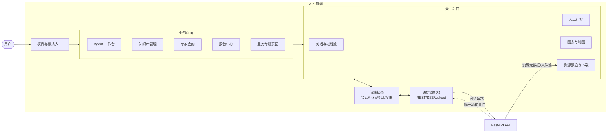
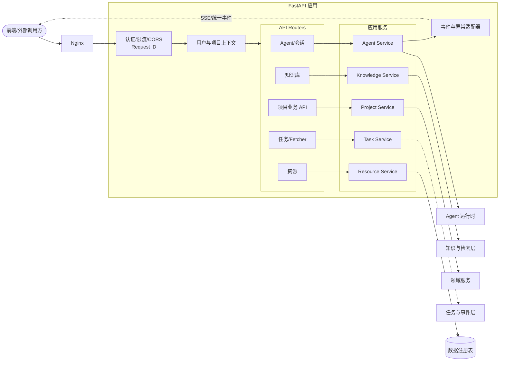
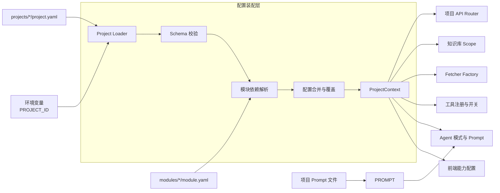
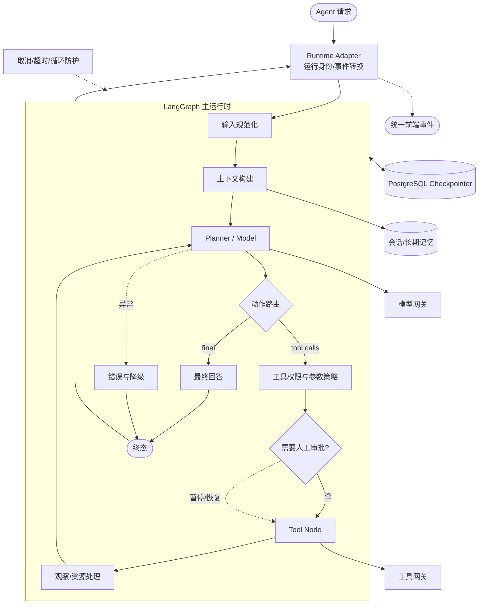
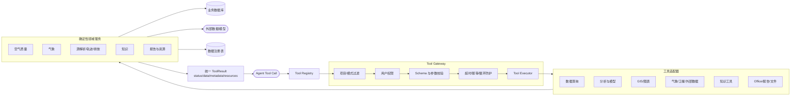
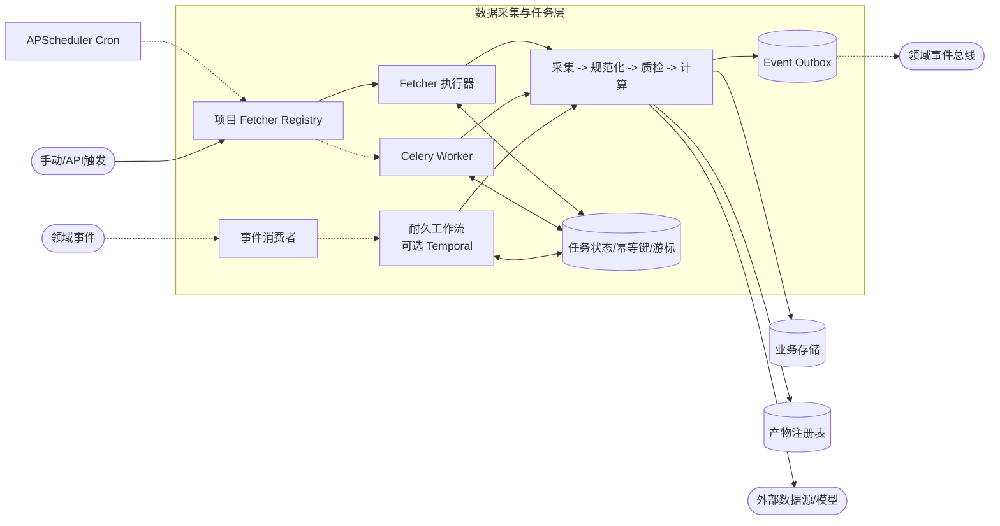
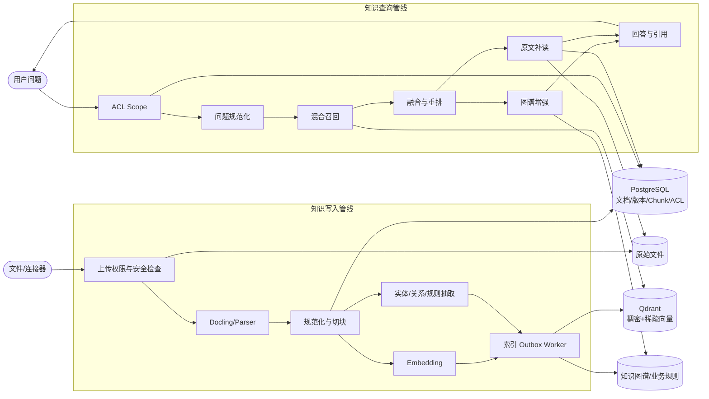
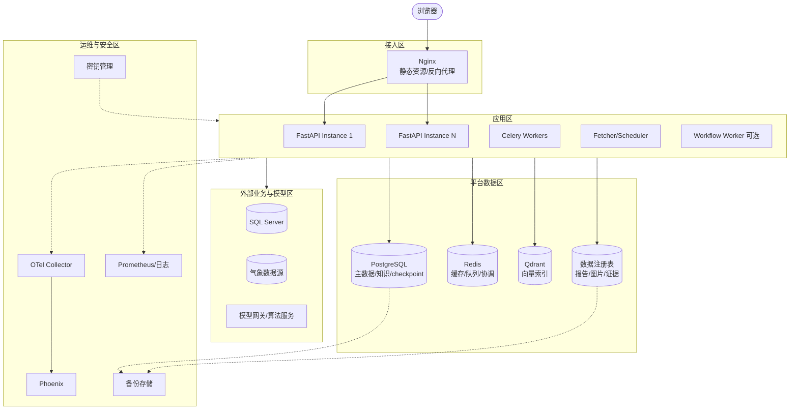
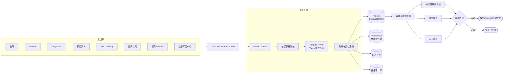
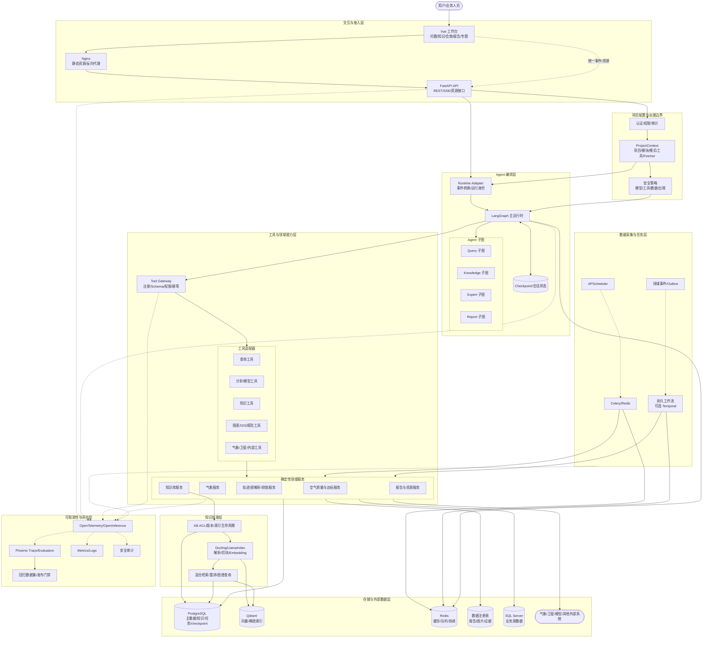

# 溯源平台通用架构层梳理

## 1. 文档定位

- 文档目的：说明溯源平台当前通用架构、各层职责、可采用的开源组件、不可直接替换的边界，以及建议迁移路线。
- 分析基线：许昌分支当前代码与《溯源平台智能体框架选型说明（LangGraph + CrewAI + LlamaIndex）》v1.0。
- 适用范围：平台共享能力，不包含许昌等单一项目的阈值、算法、业务事件和专属工具实现。
- 核心结论：采用“一个主编排运行时 + 可插拔知识组件 + 确定性领域服务”的目标架构，不同时维护多套相互重叠的 Agent 工作流运行时。

## 2. 当前总体架构

```text
用户浏览器
    |
Vue 前端 / Nginx 静态资源
    |
FastAPI API、SSE/流式事件、资源访问接口
    |
项目配置层（projects/*/project.yaml + modules/*/module.yaml）
    |
Agent 模式层（query / knowledge / expert / report 等）
    |
自研 AgentRuntime
    +-- Planner / ReAct 循环
    +-- ToolCoordinator / ToolExecutor
    +-- 会话记忆、上下文压缩、转录写入与修复
    +-- 取消、暂停、转向输入、附件与资源事件
    +-- 子 Agent 与专家会商
    |
领域工具、知识服务、报告服务、确定性业务服务
    |
Fetcher / APScheduler / Celery / 业务事件
    |
SQL Server / PostgreSQL / Qdrant / Redis / 文件数据注册表
    |
空气质量、气象、卫星、排放清单、模型服务等外部数据源
```

当前 `backend/app/agent/runtime/agent_runtime.py` 不只是模型调用循环，还负责运行身份、流式事件、会话串行化、工具协调、附件、取消和终态写入。当前知识库也包含权限、文档版本、分块差异、索引 outbox、场景、知识图谱和证据溯源。因此，开源框架只能替换其中的通用机制，不能按目录整体删除。

## 3. 分层职责

### 3.1 前端交互层

职责：

- 提供 Agent 工作台、知识库、专家会商、报告、图表和资源预览。
- 消费统一的流式事件，展示思考、工具调用、工具结果、最终回答和错误状态。
- 管理项目品牌、工作区布局和可用 Agent 模式。

通用边界：前端只依赖稳定事件协议和资源协议，不应依赖某个 Agent 框架的原生事件结构。

### 3.2 API 与应用服务层

职责：

- 提供认证、会话、Agent 执行、知识库、文件、Fetcher 和项目业务 API。
- 将内部异常转换为稳定的 HTTP/流式错误结构。
- 承担用户、项目、知识库、资源等访问控制。

建议：继续保留 FastAPI。Agent 框架应作为应用内部库使用，不应直接替换现有 API、认证和资源交付接口。

### 3.3 项目与模块配置层

职责：

- 通过 `projects/*/project.yaml` 声明项目启用的模块、工具、Fetcher、提示词、知识库和前端能力。
- 通过 `modules/*/module.yaml` 表达模块依赖。
- 在共享代码与项目代码之间建立部署边界。

该层属于平台核心架构，应继续自研并保持框架中立。LangGraph、CrewAI、LlamaIndex 均不能替代项目配置和模块装配机制。

### 3.4 Agent 运行时与编排层

当前职责：

- 构建上下文并调用 Planner。
- 执行单工具或并行工具调用。
- 控制最大迭代、重复工具防护、超时、取消和终态。
- 维护会话记忆、运行身份、转录和前端流式事件。
- 接受运行中的用户转向输入及人工干预。

主要问题：状态与控制流分散在多个组件，隐式契约多；长任务缺少标准化断点；自研流式协议与模型供应商响应耦合较深。

### 3.5 工具与领域服务层

职责：

- 工具注册、schema、权限、项目开关和执行。
- 封装空气质量、气象、GIS、卫星、轨迹、Office、知识检索和报告能力。
- 执行确定性算法并返回带来源、时间、单位和文件资源的结构化结果。

该层是平台主要业务资产。迁移时只增加 Agent 框架适配器，不修改工具内部算法和结果契约。

### 3.6 数据采集与任务层

职责：

- Fetcher 定时获取外部数据并落库。
- 执行预测、监测、告警和长耗时模型任务。
- 发布可被定时任务或业务流程消费的领域事件。

当前简单 cron 由 APScheduler 承担。Celery、Redis 已在依赖中，可承接异步计算。需要跨进程恢复、补偿、人工等待数小时或数天的任务时，再引入耐久工作流引擎。

### 3.7 知识与检索层

职责：

- 文档上传、解析、切块、向量化和索引。
- 用户及知识库权限过滤。
- 稠密/稀疏混合检索、重排和原文补读。
- 知识图谱抽取、版本、审核、业务规则和证据路径。

Qdrant 已经作为向量存储使用，LlamaIndex Core 已作为可选图谱抽取组件依赖。适合逐步复用开源 reader、node parser、ingestion pipeline 和 retriever，而不是整体替换知识库数据模型。

### 3.8 存储与基础设施层

- SQL Server：部分业务源数据及许昌预测结果。
- PostgreSQL：平台关系数据、知识元数据和部分气象数据。
- Qdrant：向量及稀疏检索。
- Redis：取消状态、缓存、队列和并发协调。
- 数据注册表：报告、证据包、图片及中间产物。
- Nginx：正式前端静态资源和反向代理。

建议以 PostgreSQL、Redis、Qdrant 为平台基础组合；外部 SQL Server 保持数据源适配，不向 Agent 暴露直接数据库权限。

### 3.9 可观测性、安全与评估层

当前已有结构化日志和部分运行日志，但缺少统一的模型、检索、工具和业务节点 Trace，以及可重复执行的效果数据集。

目标能力：

- OpenTelemetry/OpenInference 统一埋点。
- 全链路记录模型、检索、工具、成本、耗时、错误与输入输出摘要。
- 敏感字段脱敏和按项目、用户、会话隔离。
- 建立离线回归集，分别评估工具选择、参数正确性、检索召回、事实一致性和业务规则命中。

## 4. 逐层架构图绘制说明

本章用于指导绘制九张分层架构图。每张图均采用“左侧输入、中央处理、右侧输出、底部依赖”的布局，并通过相同节点名称与总体架构图衔接。

### 4.1 统一绘图规范

建议图例：

| 图形或连线 | 含义 |
|---|---|
| 矩形 | 应用、服务或处理组件 |
| 圆角矩形 | 用户入口、外部系统或交付出口 |
| 圆柱体 | 数据库、缓存、向量库或文件存储 |
| 实线箭头 | 同步请求、函数调用或直接数据访问 |
| 虚线箭头 | 事件、消息、异步任务或定时触发 |
| 分组框 | 部署单元、子系统或职责边界 |
| 红色边框 | 安全边界或高风险操作 |
| 蓝色边框 | 平台通用能力 |
| 绿色边框 | 确定性领域能力 |
| 灰色边框 | 外部依赖 |

每张图右下角建议保留两个说明区：

1. 接口契约：列出该层对上层和下层输出的主要协议。
2. 边界说明：列出该层不承担的职责，防止层间职责重新耦合。

### 4.2 前端交互层架构图

#### 绘图目标

展示用户如何通过统一工作台进入不同 Agent 模式，前端如何消费 API、流式事件和资源，并保持与具体 Agent 框架解耦。

#### 建议分组与节点

- 用户入口：浏览器、桌面端或大屏。
- 页面层：Agent 工作台、知识库管理、专家会商、报告中心、空气质量和业务专题页面。
- 交互组件层：模式选择器、对话区、工具过程区、图表/地图区、资源预览区、人工审批组件。
- 前端状态层：会话状态、运行状态、项目配置、资源索引、用户权限。
- 通信适配层：REST Client、SSE/流式事件 Client、文件上传下载 Client。
- 下游接口：FastAPI API Gateway、统一事件协议、统一资源协议。

#### 关键数据流

1. 用户选择项目和 Agent 模式，前端加载项目配置。
2. 用户提交文本、文件或审批决定。
3. REST 接口创建或控制运行，SSE 接收增量事件。
4. 工具结果中的资源引用进入资源面板，而不是由页面拼接本地路径。
5. 运行结束后更新会话转录、图表、地图和报告状态。

#### Mermaid 草图



#### 接口与边界

- 向下接口：HTTP JSON、SSE 事件、multipart 文件上传、受控资源下载。
- 对上输出：页面状态、可视化结果、审批输入和可访问资源。
- 不承担：模型选择策略、工具权限判断、业务算法和数据库直连。

### 4.3 API 与应用服务层架构图

#### 绘图目标

展示所有外部请求如何经过认证、项目上下文和访问控制进入应用服务，并统一转换为 Agent、知识、任务或资源调用。

#### 建议分组与节点

- 边界入口：Nginx、FastAPI Router、CORS/限流。
- 身份与上下文：认证、用户上下文、项目上下文、请求 ID。
- API 域：Agent API、会话 API、知识库 API、资源 API、任务/Fetcher API、项目业务 API。
- 应用服务：Agent Service、Knowledge Service、Resource Service、Scheduled Task Service、Project Service。
- 协议适配：流式事件适配器、异常映射、Pydantic schema、审计中间件。
- 下游：Agent 运行时、领域服务、存储层和消息/任务层。

#### 关键数据流

1. Nginx 将 API 请求转发给 FastAPI。
2. 中间件解析用户、项目、会话和请求身份。
3. Router 只完成协议处理，将业务交给应用服务。
4. Agent Service 把运行时内部事件转换为前端稳定事件。
5. Resource Service 校验权限后返回文件或浏览器可访问地址。

#### Mermaid 草图



#### 接口与边界

- 向上接口：稳定 REST、SSE、资源访问协议。
- 向下接口：应用服务方法、运行时事件迭代器、仓储接口、任务事件。
- 不承担：在 Router 中编写污染算法、直接拼接 Agent Prompt 或绕过权限读取文件。

### 4.4 项目与模块配置层架构图

#### 绘图目标

展示同一套共享平台如何通过项目清单和模块依赖装配成不同项目实例，以及配置如何控制前端、Agent、工具、Fetcher 和知识库。

#### 建议分组与节点

- 配置源：环境变量、`projects/*/project.yaml`、`modules/*/module.yaml`、项目提示词。
- 配置加载：路径解析、schema 校验、模块依赖解析、配置合并。
- 项目上下文：项目 ID、启用模块、前端能力、Agent 模式、工具白名单/黑名单、Fetcher、知识集合。
- 消费方：前端配置 API、Tool Registry、Fetcher Factory、Prompt Loader、Knowledge Scope、项目 Router。

#### 关键数据流

1. 启动时根据 `PROJECT_ID` 定位项目清单。
2. 校验清单并递归解析模块依赖。
3. 合并模块默认能力与项目覆盖项。
4. 生成不可变的 ProjectContext。
5. 各消费方只读取 ProjectContext，不自行解析项目文件。

#### Mermaid 草图



#### 接口与边界

- 核心输出：经过校验的 ProjectContext 和模式 Prompt。
- 安全要求：项目工具、知识库和业务 API 必须默认拒绝，只有清单显式启用后开放。
- 不承担：运行时动态业务状态、用户个人偏好和外部密钥明文存储。

### 4.5 Agent 运行时与编排层架构图

#### 绘图目标

展示一个 Agent Run 从接收请求、构建上下文、模型规划、工具执行到完成或人工暂停的完整状态图，并标明自研适配层与 LangGraph 的边界。

#### 建议分组与节点

- Runtime Adapter：接收现有 Agent Service 请求，生成运行身份并转换事件。
- Graph State：消息、模式、用户/项目、附件、资源、迭代、错误和审批状态。
- 图节点：输入规范化、上下文构建、Planner/Model、工具路由、工具执行、观察处理、人工审批、最终回答、错误终态。
- 通用控制：checkpoint、重试、取消、超时、循环防护、并发会话隔离。
- 外部依赖：Model Gateway、Tool Gateway、Memory/Conversation Store、Checkpointer。

#### 关键数据流

1. Runtime Adapter 创建 `run_id`，把请求转换为 Graph State。
2. Context Builder 合并系统提示词、会话记忆、项目配置、附件和可用工具。
3. Planner 输出最终回答或结构化工具调用。
4. Tool Router 校验模式权限和参数后执行工具。
5. 工具结果写入观察和资源引用，再回到 Planner。
6. 高风险工具进入 HITL，保存 checkpoint 后等待批准、编辑或拒绝。
7. Finalizer 写入转录并发出完成、失败或中断事件。

#### Mermaid 草图



#### 接口与边界

- Graph State 只保存可序列化状态；大型文件、图片和业务证据只保存资源 ID 或规范路径。
- checkpoint 用于运行恢复，不替代业务数据库和证据包。
- 模型不能绕过 Tool Gateway 直接访问数据库、文件系统或外部接口。
- 有副作用的节点必须幂等，恢复时不得重复发事件、写数据库或提交外部任务。

### 4.6 工具与领域服务层架构图

#### 绘图目标

展示 Agent 工具调用如何经过注册、项目过滤、安全策略和执行器，到达确定性领域服务，并返回统一结果和资源。

#### 建议分组与节点

- 工具描述：Tool Registry、名称、描述、JSON Schema、版本、所属模块。
- 执行控制：项目开关、模式白名单、用户权限、参数校验、超时、幂等、审计。
- 工具分类：查询、分析、GIS/可视化、卫星/气象、知识、Office/报告、文件与浏览器。
- 领域服务：空气质量、气象、源解析、轨迹、排放、知识、报告。
- 结果契约：status、data、summary、metadata、resources、error。

#### 关键数据流

1. Agent 只获得当前项目、模式和用户允许的工具 schema。
2. Tool Gateway 再次执行服务端权限和参数校验。
3. Tool Adapter 将通用工具参数转换为领域服务 DTO。
4. 领域服务执行查询或确定性算法。
5. 大型结果写入数据注册表，工具结果只返回资源引用和摘要。
6. 调用、耗时、结果状态和证据 ID 写入审计 Trace。

#### Mermaid 草图



#### 接口与边界

- 工具是 Agent 与业务能力之间唯一受控入口。
- 领域服务不得依赖对话上下文；所需城市、时间、污染物等必须显式传入。
- ToolResult 中必须区分数据、摘要、来源、资源和错误，不返回无法审计的自由文本结果。

### 4.7 数据采集与任务层架构图

#### 绘图目标

展示定时采集、异步计算、领域事件和耐久长流程之间的职责划分，以及任务如何保证幂等、重试和结果登记。

#### 建议分组与节点

- 触发器：APScheduler Cron、API 手动触发、领域事件、补数命令。
- Fetcher 管理：项目 Fetcher Factory、Fetcher Registry、运行状态。
- 执行通道：同步 Fetcher、Celery Worker、耐久工作流引擎（可选）。
- 处理步骤：采集、规范化、质量检查、落库、计算、产物登记、事件发布。
- 控制存储：任务状态、幂等键、重试次数、游标、水位和死信。

#### 关键数据流

1. 项目上下文只注册当前项目启用的 Fetcher。
2. APScheduler 触发短任务；耗时计算提交 Celery。
3. 跨小时/跨天并需要补偿的流程交给耐久工作流引擎。
4. 每个任务以业务主键和时间窗口生成幂等键。
5. 数据落库和事件发布使用 outbox 或等价机制避免状态不一致。

#### Mermaid 草图



#### 接口与边界

- APScheduler 只负责触发，不作为业务状态存储。
- Celery 适合独立异步任务，不天然表达长时间人工等待和多步补偿。
- 工作流任务只编排步骤，阈值和算法仍在领域服务中。
- 所有外部采集必须记录数据来源、抓取时间、业务时间和质量状态。

### 4.8 知识与检索层架构图

#### 绘图目标

分别展示“知识写入管线”和“知识查询管线”，并突出 ACL、版本、来源和索引一致性不是 LlamaIndex 自动提供的业务能力。

#### 建议分组与节点

- 写入入口：文件上传、共享目录、外部连接器。
- 写入管线：权限校验、病毒/格式检查、Docling 解析、规范化、切块、实体/规则抽取、embedding、索引 outbox。
- 查询管线：问题规范化、ACL Scope、稠密/稀疏召回、融合、重排、图谱检索、原文补读、答案与引用。
- 存储：文档元数据、原始文件、Chunk 数据、Qdrant、图谱/业务规则、索引状态。
- 可选开源适配：LlamaIndex Reader、Node Parser、Ingestion Pipeline、Retriever。

#### 关键数据流

1. 文档先写关系库和文件存储，形成受权限控制的文档版本。
2. 解析和切块产生带文档、页码、版本和权限 metadata 的 Chunk。
3. outbox 驱动向量及图谱索引，失败可重试。
4. 查询先计算用户可访问的知识库范围，再生成向量过滤条件。
5. 召回结果重排后，必要时补读相邻块或查询图谱。
6. 最终回答必须返回能够定位原文的引用对象。

#### Mermaid 草图



#### 接口与边界

- LlamaIndex 位于解析/切块/检索适配位置，不成为权限和文档生命周期的事实源。
- PostgreSQL 文档状态是主记录，Qdrant 和图谱是可重建索引。
- 删除、替换和权限变更必须传播到所有索引。
- 引用至少包含知识库、文档、版本、Chunk 或页码定位信息。

### 4.9 存储与基础设施层架构图

#### 绘图目标

展示部署单元、数据存储、网络区域和备份关系，区分平台主数据、业务源数据、缓存、索引和文件产物。

#### 建议分组与节点

- 接入区：Nginx。
- 应用区：FastAPI 实例、Celery Worker、Fetcher/Scheduler、可选工作流 Worker。
- 数据区：PostgreSQL、Redis、Qdrant、数据注册表。
- 外部业务数据区：SQL Server、气象数据库、模型服务。
- 运维区：Phoenix、Prometheus、日志、备份和密钥管理。

#### 关键数据流

1. 浏览器只能访问 Nginx 暴露的前端、API 和受控资源路径。
2. FastAPI 和 Worker 访问内部数据库，不向 Agent 暴露连接字符串。
3. PostgreSQL 保存事务主数据和 checkpoint；Qdrant 保存可重建索引。
4. Redis 用于缓存、队列和短期协调，不保存唯一业务事实。
5. 数据注册表保存大文件并通过资源服务授权访问。
6. 数据库、文件和配置执行独立备份与恢复演练。

#### Mermaid 草图



#### 接口与边界

- 图中应明确公网、应用内网、数据内网和外部专线/网关边界。
- SQL Server 是业务数据源，不应成为平台会话和知识元数据主库。
- Qdrant、Redis 故障不得造成权限主数据和原始证据永久丢失。
- 正式部署应补充主从、高可用、容量、RPO、RTO 和备份保留周期。

### 4.10 可观测性、安全与评估层架构图

#### 绘图目标

该层是横切架构图，展示一次请求产生的 Trace、Metric、Log、Audit 和 Evaluation 数据如何被采集、脱敏、存储和使用。

#### 建议分组与节点

- 埋点源：前端、FastAPI、LangGraph、模型网关、Tool Gateway、检索、任务和数据库客户端。
- 采集层：OpenTelemetry SDK、OpenInference、OTel Collector。
- 处理层：采样、脱敏、属性规范化、项目/用户/会话关联、敏感数据策略。
- 后端：Phoenix Trace/Evaluation、Prometheus Metric、日志平台、安全审计库。
- 评估：生产 Trace 采样、离线数据集、规则评估、LLM Judge、人工复核、发布门禁。
- 告警：可用性、性能、成本、越权、工具失败、数据质量和答案质量。

#### 关键数据流

1. API 创建根 Trace ID，并传播到 Agent、工具、检索、任务和领域事件。
2. 每个节点记录耗时、状态和必要摘要，不默认记录完整敏感输入。
3. Collector 统一脱敏和路由到 Trace、Metric、Log 和 Audit 后端。
4. 高风险工具调用和权限拒绝进入不可变审计记录。
5. 典型生产 Trace 经脱敏后进入离线评估集。
6. 新模型、Prompt、检索策略和框架版本必须通过回归门禁。

#### Mermaid 草图



#### 接口与边界

- Trace ID 应贯穿 HTTP 请求、Agent Run、Tool Call、领域事件和后台任务。
- Trace 系统不是业务事实源，关键告警和证据仍写业务数据库或证据包。
- 默认不记录密钥、完整附件、数据库连接串、身份证明和未经脱敏的用户数据。
- LLM-as-a-Judge 只能作为一类评估信号，不能替代确定性规则和人工复核。

### 4.11 九张分层图的组合关系

绘制总图时可将九层压缩为以下五条主链：

```text
交互链：前端 -> API -> Agent Runtime -> Tool/Domain -> 结果资源
配置链：ProjectContext -> 前端/API/Agent/Tool/Fetcher/Knowledge
数据链：外部数据 -> Fetcher/Task -> Storage -> Tool/Knowledge -> Agent
知识链：文档 -> Ingestion -> PostgreSQL/Qdrant/Graph -> Retrieval -> Agent
治理链：所有层 -> OTel/安全审计/评估 -> 告警与发布门禁
```

总图只保留每层 2 至 4 个核心节点；进入方案设计或研发评审时，再分别使用本章的九张细化图。

## 5. 开源替换建议

| 能力域 | 当前实现 | 推荐组件 | 替换范围 | 必须保留的自研能力 |
|---|---|---|---|---|
| Agent 状态与控制流 | AgentRuntime + Planner | LangGraph OSS | 状态图、节点重试、条件分支、checkpoint、interrupt | API、项目模式、事件转换、权限、资源和转录契约 |
| 常规 ReAct Agent | 自研 Planner | LangChain Agent 或 LangGraph 预构建 Agent | 标准模型工具循环 | 特殊模式、附件、报告、画板和终态策略 |
| 专家会商编排 | ExpertDeliberationEngine | 优先 LangGraph 子图 | 专家并行、轮次、暂停、恢复 | 事实账本、证据矩阵、异议、禁止性结论、审查规则 |
| 多角色自治试验 | 自研子 Agent | CrewAI 可选 PoC | 独立、低风险的角色协作实验 | 不作为第一阶段主运行时，不接管业务审计链 |
| 文档解析 | 多个自研 parser | Docling；必要时 Unstructured | PDF/DOCX/PPTX/HTML 结构化解析 | 文件权限、原文哈希、页码/块级来源和版本记录 |
| RAG 组件 | 自研 ingestion/retrieval | LlamaIndex Core | reader、切块、节点、检索器、重排器适配 | 知识库 ACL、场景、outbox、审计、业务规则与证据模型 |
| 向量数据库 | Qdrant | 继续使用 Qdrant | 无需替换 | collection 隔离、metadata 过滤和生命周期管理 |
| 模型统一网关 | 多供应商适配器 | LiteLLM Proxy 可选 | OpenAI 兼容接口、路由和基础限流 | 国密、模型白名单、数据出境、审计和供应商策略 |
| 定时调度 | APScheduler | 继续使用 APScheduler | 单进程 cron | 项目 Fetcher 注册和业务事件 |
| 异步任务 | Celery + Redis 依赖 | Celery + Redis | 文档解析、索引、批量计算 | 任务幂等键、业务状态和产物登记 |
| 耐久业务流程 | 文件状态 + 定时扫描 | Temporal 可选 | 跨进程恢复、补偿、长时间人工等待 | 业务状态机、规则和审批语义 |
| Agent 可观测性 | structlog/运行日志 | OpenTelemetry + Phoenix | Trace、评估、数据集与实验 | 脱敏、权限、项目隔离和留存策略 |

## 6. 推荐目标架构

```text
                        +----------------------+
                        | 项目/模块配置与权限层 |
                        +----------+-----------+
                                   |
前端事件协议 <-> FastAPI <-> Agent Runtime Adapter
                                   |
                        +----------v-----------+
                        | LangGraph 主运行时    |
                        | query / knowledge     |
                        | expert / report 子图  |
                        +----+-------------+----+
                             |             |
                   +---------v--+      +---v----------------+
                   | 通用工具网关 |      | 确定性领域工作流    |
                   +-----+------+      +---+----------------+
                         |                 |
           +-------------+------+    +-----+----------------+
           |                    |    |                      |
    LlamaIndex 适配层      报告/GIS等工具  Celery/Temporal      Fetcher
           |                    |    |                      |
    PostgreSQL + Qdrant + Redis + SQL Server + 数据注册表
    |
                     OpenTelemetry / Phoenix
```

### 6.1 总体架构 Mermaid 图

这张图用于方案汇报、技术评审和总览页；各层细节应下钻到第4章的九张图。绘制时建议把“确定性领域服务”和“Agent 编排”放在两个不同颜色的分组中，明确 LLM 不是业务算法执行器。



### 6.2 总图绘制时必须保留的关系

- 前端只能通过 API、SSE 和资源协议访问平台，不能直接连接模型、数据库和 Qdrant。
- Agent 只能通过 Tool Gateway 使用领域能力，不能绕过权限直接调用 SQL、文件系统或外部服务。
- Fetcher 和后台任务可以产生领域事件，但不能直接修改 Agent 对话文本；Agent 通过事件或查询读取业务结果。
- PostgreSQL 保存平台主数据；Qdrant 是可重建索引；Redis 是缓存和协调组件；文件注册表保存大文件产物。
- OpenTelemetry 从 API、Agent、工具、知识检索和任务层横向采集，但 Trace 系统不替代业务证据数据库。
- 项目配置层贯穿前端能力、Agent 模式、工具权限、Fetcher 注册和知识库范围。

关键约束：

1. LangGraph 是内部运行时，不把框架原生对象直接暴露给前端和数据库。
2. 工具输入输出先稳定，再编写 LangGraph Tool Adapter。
3. 领域事件、证据包和算法结果独立于 Agent checkpoint 保存。
4. 同一业务链只使用一个耐久编排引擎，避免 LangGraph、CrewAI、Temporal 三层嵌套。
5. LLM 只负责意图、信息提取、证据归纳和文本生成，不负责确定性阈值与数值计算。

## 7. 不可直接替换的边界

- 项目/模块装配、工具白名单和项目数据隔离。
- 用户、知识库、文件和会话权限。
- 前端流式事件、资源预览和下载协议。
- 数据来源、时间范围、单位和证据文件的溯源契约。
- 环境算法、模型参数、质量门控、告警阈值和结论等级。
- 专家会商事实账本、异议记录和禁止性结论。
- 国密、私有化模型网关、日志脱敏和数据出境控制。

## 8. 迁移路线

### 阶段 0：建立基线

- 固化现有流式事件、工具调用、会话转录和资源结果 schema。
- 建立查询、知识问答、异常恢复、取消、附件、报告等回归数据集。
- 记录当前成功率、平均耗时、工具参数错误率、人工修复量和模型成本。

验收标准：旧运行时关键行为有自动化回归覆盖，迁移前后可进行同输入对比。

### 阶段 1：LangGraph 最小试点

- 只迁移无副作用的 query 模式。
- 实现 Planner、Tool、Final Answer 三类节点。
- 通过适配器继续输出现有前端事件。
- 使用 PostgreSQL checkpointer，验证中断恢复和并发会话隔离。

验收标准：答案质量不降低；工具成功率不降低；事件和资源协议保持兼容。

### 阶段 2：知识与报告工作流

- 将知识问答实现为 LangGraph 子图。
- 在现有知识库服务内部逐步接入 LlamaIndex ingestion/retriever。
- 迁移报告生成、人工确认和长文本任务。

验收标准：ACL 无越权；引用可回到原文；文档替换、删除和索引补偿测试全部通过。

### 阶段 3：专家会商

- 将每个专家、补证、主持审查和报告生成建模为显式节点。
- 并行执行领域专家，但统一写入事实账本。
- 在关键结论发布前增加 HITL 审批。

验收标准：事实、意见、异议和禁止性结论均可追溯；恢复后不重复执行有副作用工具。

### 阶段 4：长流程与生产运维

- 对跨小时、跨天和外部模型任务评估 Temporal；简单任务继续使用 Celery/APScheduler。
- 上线 OpenTelemetry/Phoenix、离线评估集、容量和故障演练。
- 双轨运行一个发布周期后再下线对应旧路径。

## 9. 选型文档需要修正的内容

- 当前代码规模已经显著超过原文档估算，不能按“7800 行通用层”制定工期。
- LangGraph、CrewAI、LlamaIndex 的开源核心可免费商用，但 LangSmith 自托管属于商业 Enterprise 能力，需单独评估授权。
- GitHub Stars、贡献者、周提交量和 Issue 解决量必须注明统计日期和数据来源，不能作为核心 ROI 依据。
- “一行接入”“全部 Bug 由社区兜底”“维护成本下降 80%”应改为 PoC 待验证指标。
- 不应使用无法在权威漏洞库核实的 CVE 案例。
- 开源框架增加了供应链、版本兼容和上游变更风险，仍需锁版本、SBOM、漏洞扫描和回归测试。

## 10. 最终建议

1. 采用 LangGraph 作为唯一主 Agent 编排运行时。
2. 第一阶段不引入 CrewAI；专家会商先实现为 LangGraph 子图。
3. LlamaIndex 只替换知识处理组件，不接管知识库业务模型。
4. 保留 Qdrant、FastAPI、项目配置、工具体系和领域服务。
5. 优先建设统一事件契约、OpenTelemetry 可观测性和回归评估体系，再进行运行时替换。
6. 所有迁移均采用适配器和双轨验证，不进行一次性目录级重写。

## 11. 主要代码依据

- `backend/app/agent/runtime/agent_runtime.py`
- `backend/app/agent/runtime/tool_coordinator.py`
- `backend/app/services/expert_deliberation/deliberation_engine.py`
- `backend/app/knowledge_base/`
- `backend/app/fetchers/base/scheduler.py`
- `backend/app/tools/__init__.py`
- `backend/app/project_config/`
- `backend/requirements.txt`
