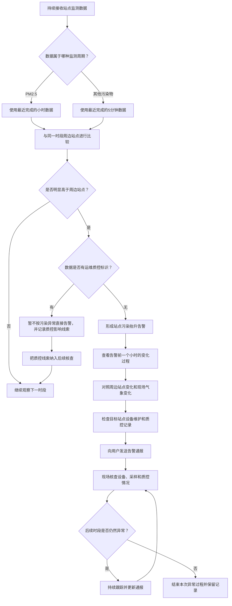

# 场景1：站点快速污染告警业务流程

## 一句话说明

持续观察许昌各监测站点的污染物变化。一旦发现某个站点明显高于周边站点，先排除运维质控影响，再把清晰的监测事实、变化趋势和现场核查重点及时告诉相关人员，争取在污染峰值形成前完成排查。

## 业务流程图

## 流程说明

### 1. 持续接收监测数据

持续接收许昌各站点的污染物监测结果。每个结果包含站点、时间、污染物和数值等信息；如果监测过程中进行了维护、校准或其他质控操作，也会带有相应标识。

### 2. 按污染物选择观察周期

- PM2.5 目前使用小时数据，按最近完成的小时进行判断。
- PM10、SO2、NO2、CO、O3 以及 NOX（以 NO2 作为观察依据）使用 5 分钟数据，尽快发现短时间抬升。

### 3. 与周边站点比较

比较目标站点与同一时段其他站点的监测结果，重点看目标站点是否持续、明显高于周边站点。

当前时段的比较回答：这个站点现在是否明显偏高？

历史变化的比较回答：这个站点是在上升，还是周边站点也一起上升？

### 4. 判断是否达到告警条件

如果目标站点没有明显高于周边站点，则继续观察，不发送告警。

如果目标站点明显偏高，则进入质控标识核查。

### 5. 处理运维质控标识

如果相关 5 分钟数据带有维护、校准或质控标识：

- 该条数据不直接作为污染异常告警依据。
- 记录标识出现的时间和污染物。
- 在后续核查中确认变化是否由运维操作造成。

如果没有质控标识，则形成污染抬升告警。

### 6. 告警前一小时复核

形成告警后，查看告警前一个小时的 5 分钟监测过程，重点关注：

- 目标站点数值是否连续上升。
- 相邻两个 5 分钟时段升幅是否明显。
- 周边站点是否同步变化。
- 目标站点是否始终明显偏离周边站点。
- 目标站点是否出现维护、校准或其他质控标识。

PM2.5 告警查看告警前后的小时变化，不将其描述为 5 分钟变化。

### 7. 结合近期气象变化

查看最近几个小时的实况气象变化，包括风速、风向、温度、湿度、降水，以及风场和扩散条件是否发生变化。气象信息用于理解污染变化背景，不单独作为污染来源结论。

### 8. 发送告警通报

告警通报应让用户快速了解：哪个站点、哪种污染物、当前数值与周边站点的差异、最近一小时如何变化、周边站点是否同步、近期气象如何变化，以及是否发现维护或质控标识。

有效站点数量、质控豁免数量等属于内部判断信息，只有在数据不足或结论受到影响时才向用户说明。

### 9. 现场排查与过程跟踪

收到告警后，现场人员优先核查设备运行状态、采样管路和采样口、校准维护及质控记录、近期耗材或设备操作，以及目标站点与周边站点的现场情况。

如果后续时段仍然异常，则继续跟踪并更新告警信息；如果恢复正常，则结束本次异常过程并保留完整记录。

## 业务角色分工

| 角色 | 主要工作 |
| --- | --- |
| 监测值班人员 | 关注告警通报，组织现场核查 |
| 现场运维人员 | 核实设备运行、维护和质控情况 |
| 业务分析人员 | 结合站点对比、变化趋势和气象信息判断异常性质 |
| 管理人员 | 根据告警严重程度安排排查优先级和后续处置 |

## 需要避免的误解

- 站点偏高只表示监测结果存在空间差异，不直接等同于某个企业造成污染。
- 没有质控标识也不代表污染原因已经确定，只代表需要开展现场排查。
- 周边站点同步上升时，应关注区域性变化；只有单站点异常时，应优先核查设备和采样环节。
- PM2.5 的小时变化和其他污染物的 5 分钟变化必须分开描述。
