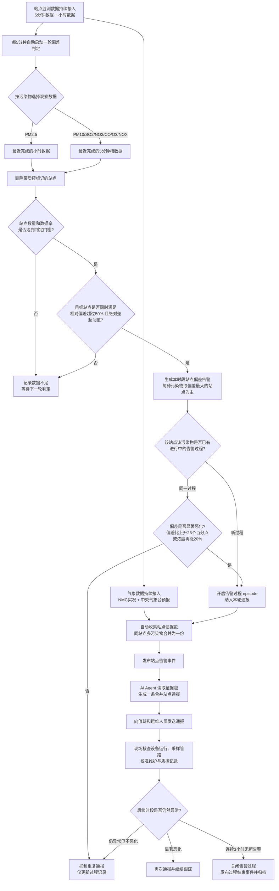

# 许昌场景1：站点快速污染告警业务流程

## 业务定位

"站点快速污染告警"是许昌市空气质量监测的高频异常发现工作。系统每 5 分钟自动对各监测站点进行一次空间偏差筛查：一旦某个站点的污染物浓度明显高于同一时段其他站点的水平，就自动归并告警过程、收集完整证据，并由 AI Agent 生成一条简明通报发送给值班人员，争取在污染峰值形成前完成现场排查。

这项工作有三个特点：

- **分钟级响应**：数据槽完成后约 1～2 分钟内完成判定，PM10、SO2、NO2、CO、O3 等使用 5 分钟数据，尽早发现短时抬升。
- **空间对比触发**：告警不依赖绝对浓度超标，而是看"单站点是否明显偏离周边站点"，捕捉局部异常。
- **过程归并防打扰**：同站点同污染物的持续异常归并为一个告警过程（episode），只在过程开始和显著恶化时通报，避免每 5 分钟重复推送。

该流程用于快速异常发现和现场核查安排，不用于实时管控指令下发、污染贡献率计算或排放责任认定。

## 业务流程图

以下流程图可直接用于绘制正式业务流程图。方框表示系统或业务动作，菱形表示判断节点。

## 各阶段说明

### 1. 数据持续接入

系统持续接入四类数据，构成判定和通报的事实基础：

| 数据 | 更新频率 | 用途 |
| --- | --- | --- |
| 站点 5 分钟监测数据（PM10、SO2、NO2、CO、O3，NOX 以 NO2 作为观察依据） | 每 5 分钟 | 偏差判定、5 分钟趋势 |
| 站点小时监测数据（含 PM2.5） | 每小时 | PM2.5 判定、小时趋势、污染物比值 |
| 中央气象台许昌站实况（风速、风向、温度、湿度、气压、降水） | 每小时 | 通报中的气象背景 |
| 中央气象台城市预报（3 小时间隔，覆盖未来 7 天） | 每小时 | 证据包中距告警时间最近的一条预报 |

### 2. 每 5 分钟一轮偏差判定

每轮判定按污染物选择观察数据：PM2.5 使用最近完成的小时数据，其余污染物使用最近完成的 5 分钟槽数据。判定前先剔除带质控标记（维护、校准等）的站点，再进行空间对比。

**判定门槛**（不满足则只记录"数据不足"，不产生告警）：

- 参照站点数量不少于 3 个，可用站点比例不低于 80%。

**告警条件**（须同时满足）：

1. 目标站点浓度比周边站点中位数（剔除目标站点自身后计算）高出 50% 以上；
2. 超出的绝对差值达到该污染物的最低差值要求。

| 污染物 | 最低绝对差值 |
| --- | ---: |
| PM2.5 | 10 |
| PM10 | 10 |
| SO2 | 5 |
| NO2 | 10 |
| CO | 0.2 |
| O3 | 30 |
| NOX | 15 |

每个时段、每种污染物只取偏差最大的站点形成主告警，其余偏高站点记入次要站点，避免一次推送过多重复信息。

### 3. 告警过程归并（episode）

同一站点、同一污染物的连续异常归并为一个告警过程：

- **新过程开启**：首次达到告警条件，纳入本轮通报，并记录开始时间和峰值。
- **持续但不恶化**：偏差比上升不足 25 个百分点、且浓度较峰值涨幅不足 20% 时，只更新过程记录，不重复通报。
- **显著恶化**：达到上述任一恶化标准时再次通报。
- **过程关闭**：连续 3 小时没有新告警，关闭过程、发布"过程结束"事件并归档，供事后回顾。

### 4. 证据包自动收集

对纳入通报的站点，系统自动收集一份站点级证据包（同站点的多种污染物合并在同一份中），内容包括：

- **空间偏差事实**：目标站点与周边站点的逐时、逐 5 分钟对比，偏差百分比和参与比较的站点数。
- **时间趋势**：告警前 12 小时内的变化（1/3/6 小时变化、峰值、最大小时涨幅）、最近 1 小时 5 分钟变化过程。
- **质控线索**：仅当站点存在实际质控标记时列出，供区分运维影响与污染事实。
- **气象实况**：许昌站最近几小时的风速、风向、温度、湿度、降水和扩散条件。
- **最近气象预报**：距告警时间最近的一条中央气象台预报（温度、湿度、风、气压、降水概率、天气现象），并标注该预报与告警时间的时间差。
- **区域对比**：许昌与郑州、开封、周口、漯河、平顶山的变化相关性，用于区分局部异常与区域性变化。

证据包是通报的唯一事实来源，全部指标由系统预先计算，Agent 不自行改算数据。

### 5. AI Agent 生成站点通报

告警事件触发专家任务后，Agent 完整读取证据包，把同一站点的多种污染物合并成一条通报，只保留：

1. 当前空间偏差事实：站点、污染物、数据粒度、告警时间、实测值、周边中位数、绝对差、相对偏差；
2. 时间趋势：PM2.5 引用小时变化，其他污染物引用 5 分钟变化，周边站点变化作为补充；
3. 运维质控影响小节：仅当证据包中存在实际质控标记时才出现；
4. 许昌站最近几小时的气象实况。

通报不输出"综合结论""排查建议"等建议性章节，保持监测事实通报的定位。有效站点数、质控豁免数量等内部判断信息，只在数据不足或影响结论时向用户说明。

### 6. 现场核查与过程跟踪

收到通报后，现场人员优先核查设备运行状态、采样管路和采样口、校准维护及质控记录、近期耗材或设备操作，以及目标站点与周边站点的现场情况。

后续时段的判定持续进行：仍异常但不恶化时不重复打扰；显著恶化时再次通报；连续 3 小时无新告警后过程自动关闭，完整记录归档。

## 输出物一览

| 输出 | 触发条件 | 用途 |
| --- | --- | --- |
| 站点偏差告警事件 | 达到判定条件且纳入通报 | 触发 AI Agent 通报任务 |
| 站点证据包（JSON） | 纳入通报时生成 | 通报的唯一事实来源，可追溯 |
| 站点合并通报（消息） | Agent 任务执行成功 | 发送值班/运维人员 |
| 告警过程结束事件 | 连续 3 小时无新告警 | 标记过程归档，供回顾分析 |
| 过程状态记录 | 全程维护 | 保留开始、峰值、通报次数等历史 |

## 业务角色分工

| 角色 | 主要工作 |
| --- | --- |
| 监测值班人员 | 关注告警通报，组织现场核查 |
| 现场运维人员 | 核实设备运行、维护和质控情况 |
| 业务分析人员 | 结合站点对比、变化趋势和气象信息判断异常性质 |
| 管理人员 | 根据告警严重程度安排排查优先级和后续处置 |
| 系统（AI Agent） | 分钟级判定、证据收集、过程归并和通报生成 |

## 需要避免的误解

- 站点偏高只表示监测结果存在空间差异，不直接等同于某个企业造成污染。
- 带质控标记的数据不作为污染异常依据；没有质控标记也不代表污染原因已确定，只代表需要开展现场排查。
- 同一过程被抑制通报不代表异常消失，只是未发生显著恶化；过程记录仍在更新。
- 周边站点同步上升时，应关注区域性变化；只有单站点异常时，才优先核查设备和采样环节。
- PM2.5 的小时变化和其他污染物的 5 分钟变化必须分开描述；NOX 以 NO2 作为观察代理。
- 气象预报仅作为证据包中的背景信息，通报以气象实况为准。
