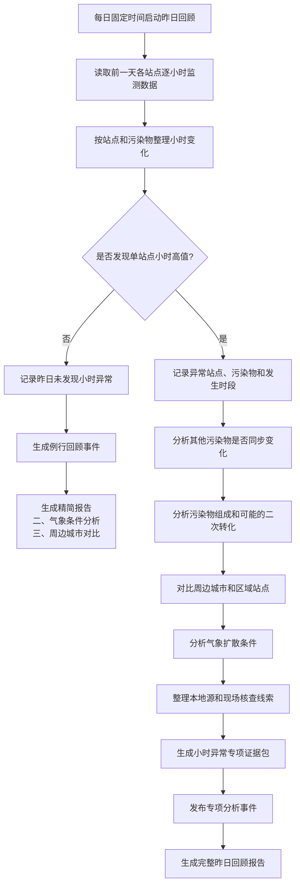

# 许昌昨日站点污染回顾业务流程

## 业务定位

“昨日站点污染回顾”是许昌市空气质量监测的每日例行分析工作。系统每天自动整理前一天各监测站点的逐小时污染数据，形成回顾材料，并在发现单站点小时高值时启动专项分析。

这项工作有两个特点：

- **每天必做**：无论是否发现异常，都会形成一份昨日回顾结果。
- **异常才深挖**：只有出现明确的单站点小时高值，才进一步开展污染过程、同步变化和来源线索分析。

该流程用于监测回顾和现场核查安排，不用于实时报警、污染贡献率计算或排放责任认定。

## 业务流程图

以下流程图可直接用于绘制正式业务流程图。圆角框表示系统或业务动作，菱形表示判断节点，虚线框表示可选的专项分析。

## 1. 每日例行启动

系统每天凌晨自动启动一次，分析对象固定为前一天（自然日）的监测数据。任务属于后台例行工作，不需要人工手动发起。

## 2. 数据整理

系统读取许昌各监测站点的逐小时污染物数据，覆盖 PM2.5、PM10、SO2、NO2、CO 和 O3 等主要指标，并按站点、污染物、小时浓度、可用站点数量和数据完整程度进行整理。

日均值和 O3 日最大 8 小时滑动平均值可以作为背景信息展示，但不再作为本流程的触发条件。

## 3. 单站点小时高值判断

系统将某站点与同一小时其他站点进行比较，以其他站点的中位数作为参照。某站点同时满足以下条件时，认定为“小时高值”：

1. 目标站点浓度比参照中位数高出 50% 以上；
2. 超出的绝对浓度超过该污染物的最低差值要求。

最低差值要求如下（单位沿用现行监测单位）：

| 污染物 | 最低差值 |
| --- | ---: |
| PM2.5 | 10 |
| PM10 | 10 |
| SO2 | 5 |
| NO2 | 10 |
| CO | 0.2 |
| O3 | 30 |

如果没有足够的参照站点或参照数据无效，系统不会判定为小时高值，只记录数据不足情况。

## 4. 没有小时异常时

没有发现小时高值并不表示任务不执行。系统仍会保存昨日回顾结果、发布“昨日站点污染回顾完成”事件、触发例行报告任务，并使用统一报告模板生成精简报告。

精简报告只保留以下两个章节：

### 二、气象条件分析

说明昨日风向、风速、湿度、边界层和其他可获得的扩散条件。没有接入的数据必须明确标注为“暂无数据”，不能补写结论。

### 三、周边城市对比

基于已有站点数据，对比许昌与周边城市或区域站点的小时变化。没有足够数据时，报告应说明比较范围和证据缺口。

## 5. 发现小时异常时

发现小时高值后，系统会为异常站点、污染物和发生时间生成专项事件，并保存异常站点、发生时间、目标浓度、参照中位数、绝对增量、相对偏差和可用站点数量等事实。

同一天出现多个异常小时，可以在后续报告中合并描述为一个污染过程，并保留开始时间、结束时间和峰值时间。

## 6. 小时异常专项分析

专项分析只针对已经满足固定规则的小时高值，不改变原始判定结果。分析内容包括：

### 其他污染物同步变化

以异常小时为中心，检查前一小时、当前小时和后一小时内其他污染物是否上升，形成“多污染物同步变化”“单一污染物变化”或“无法判断”的程序结果。

### 污染物组成特征

根据 PM10、PM2.5、SO2、NO2 和 CO 的完整小时样本计算组成比例，输出偏综合型、偏二次型、偏机动车型、偏燃煤型、偏扬尘型或其他类型。样本不足时只标记为证据不足。这些类型表示组成特征相近，不代表已确认具体排放源。

### 周边区域对比

比较周边城市和区域站点是否同步或提前变化，判断是否存在区域性变化迹象。乡镇站、省控站等未接入数据必须明确说明，不能据此推断传输方向。

### 气象条件

结合风向、风速、湿度、逆温和边界层等信息，说明污染扩散、积累或输送的气象背景。气象信息只能作为辅助证据。

### 本地核查线索

根据异常站点位置、变化时段和气象条件，整理道路、施工、物料运输和企业生产等后续核查方向。线索仅用于安排现场核查，不等同于污染责任认定。

## 7. 事件和报告输出

| 输出 | 触发条件 | 用途 |
| --- | --- | --- |
| 昨日回顾完成事件 | 每天必发 | 触发例行回顾报告 |
| 小时高值确认事件 | 发现小时异常时 | 记录异常事实 |
| 小时异常专项分析事件 | 发现小时异常且成功创建分析任务 | 触发进一步证据分析 |
| 完整回顾报告 | 有小时异常时 | 汇总异常过程和专项证据 |
| 精简回顾报告 | 无小时异常时 | 仅展示气象条件和周边城市对比 |

报告使用统一的 DOCX 参考模板生成，模板由系统配置统一管理。报告中的数据、程序判定和证据缺口应保持可追溯。

## 8. 对外发布的证据边界

- 小时高值是监测对比结果，不等同于污染源确认；
- 同步变化只能说明时间上的共同变化，不能直接证明因果关系；
- 污染物组成类型不是排放责任结论；
- 缺少组分站、乡镇站、省控站、气象或活动数据时，必须如实说明；
- 不输出未经数据支持的污染贡献率；
- 不将附近企业或工地直接表述为污染责任单位。

## 一句话总结

许昌昨日站点污染回顾是一项“每日必做、异常深挖”的例行工作：每天完成全市小时数据回顾；发现单站点小时高值时，再启动专项证据分析和完整报告；没有异常时，也会生成只包含气象条件和周边城市对比的精简报告。
