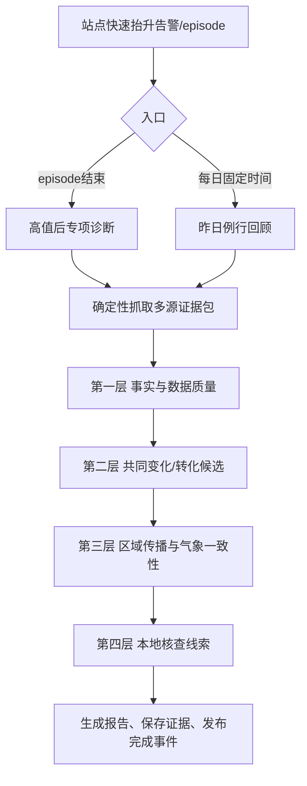

# 许昌污染抬升后诊断分析：需求设计与 PR 草案

## 1. 目标与边界

本任务承接站点快速污染抬升告警，面向两个入口：

1. **高值后专项诊断**：一个告警 episode 结束后，对该过程做一次完整取证，回答“发生了什么、可能如何发生、是否存在区域传播、下一步查哪里”。
2. **昨日例行回顾**：每天固定分析前一自然日所有站点；有小时高值时深挖，无异常时仍产出精简回顾。

两类入口使用同一证据字段和证据等级，报告展示层可不同。任务只提供监测分析和现场核查线索，不做污染贡献率、排放责任、执法认定或单一原因判定。

## 2. 业务流程



高值后任务默认监听 `xuchang.station_deviation.episode_closed`，确保过程边界稳定；没有正常结束事件时允许人工按 `episode_id` 补跑。昨日任务监听现有的 `xuchang.station_daily_pollution.review_completed`，该事件每天必发，不因无异常而跳过。

## 3. 业务分析方案：从异常到核查

这不是“自动判定污染来源”的任务，而是一套值守人员可以复核的取证步骤。每一步都回答一个业务问题，并把结果分成“事实、解释线索、待核查事项”三类。

### 3.1 分析对象和时间窗

先确定一个**污染过程**，而不是只看一个最高值：

1. 以告警 episode 的首次异常为起点，以连续无异常 3 小时或人工确认结束为终点。
2. 起点前回看 12 小时，终点后观察 6 小时，判断异常是突然出现、逐步累积还是区域背景同步变化。
3. 昨日回顾按自然日建立全市背景，再把同一站点相邻异常小时合并成过程；同一天多个站点可以并列，但不能无依据合并成一个来源事件。
4. 每个过程先填写“过程卡”：站点、污染物、开始/结束/峰值、持续时长、峰值相对站点基线的增量、有效数据率和质控情况。

### 3.2 第一问：这个高值是否真实可信

分析顺序固定为“数据质量 → 站点自身变化 → 周边对照”：

- **数据质量核对**：查看缺测、突跳、平线、质控/维护标识、校准记录和相邻时段的恢复情况。存在质控标识时，先标记“需排除运维影响”，不直接进入污染解释。
- **站点自身变化**：看 5 分钟曲线和小时曲线是否连续上升、峰值是否可定位、下降是否自然；单点单时刻尖峰只能算“待核实异常”。
- **周边对照**：比较同小时其他站点中位数、可用站点数和空间梯度。目标站点高于基线且前后时段也有一致变化，可信度高于孤立尖峰。

输出不是“真/假”二选一，而是：

| 结果 | 业务含义 | 后续动作 |
| --- | --- | --- |
| 监测异常可信 | 数据质量正常，曲线连续且与空间差异相符 | 进入机制和区域分析 |
| 监测异常待核实 | 有高值，但存在尖峰、缺测或质控疑点 | 优先核查设备、采样和运维记录 |
| 证据不足 | 参照站点或关键时段数据不足 | 暂不解释原因，等待补数 |

### 3.3 第二问：可能如何发生

以异常时刻为中心，比较其他污染物和气象要素的**先后关系**，形成候选解释，不做唯一归因。

#### A. 污染物组合

- PM2.5 与 CO、NO2 同时抬升：记录为“燃烧/机动车等一次排放线索”，还需活动或组分资料验证。
- PM2.5 与 SO2 同步：记录为“含硫燃烧或区域混合线索”；若 SO2 未变化，不能据此排除二次转化。
- PM2.5 上升而 PM10 不明显：记录为“细颗粒或二次生成线索”，需要组分、氧化性或湿度变化补证。
- PM10 与 PM2.5 同步、PM10 增幅更大：记录为“扬尘/再悬浮线索”，需结合风速、施工和道路活动核查。
- O3 上升伴随高温、低湿、强日照时：记录为“光化学过程背景线索”；不能仅凭 O3 同步证明 PM2.5 来源。

系统应展示异常前 1 小时、异常小时、后 1 小时的变化方向、幅度和有效样本数，并允许分析人员改看 3 小时窗口。

#### B. 湿度、温度和扩散条件

- 湿度快速升高且 PM2.5 同步升高：提示吸湿增长可能参与，需查看降水、能见度或组分资料。
- 风速持续低、风向稳定且边界层不利：提示污染累积条件；只能说明“气象支持累积”，不能说明排放来源。
- 风速增强后浓度下降：提示扩散改善或污染团移出，作为过程结束的辅助证据。
- 气象变化与浓度不同步：记录为“气象解释不充分”，转而加强区域站点和活动资料核查。

#### C. 候选解释的表达模板

每个候选必须同时写出“支持证据、反向证据、还缺什么”：

> 观测到 PM2.5、CO 在 14:00—15:00 同步上升，支持一次排放或共同累积线索；但缺少组分和活动记录，暂不能判断具体源类。

### 3.4 第三问：是局地异常还是区域传播

按“时间关系 → 空间关系 → 气象一致性”顺序判断：

1. **时间关系**：周边站点/城市是先升、同步还是后升；至少需要两个有效时点，不能用单小时重合下结论。
2. **空间关系**：比较目标站点到周边站点的距离、峰值差值和梯度方向；多个方向同时升高更接近区域背景，单站点突出更接近局地线索。
3. **气象一致性**：检查升高前后风向是否稳定、风速是否足以形成输送；静风、风向频繁变化或气象缺测时标记“不支持方向判断”。
4. **轨迹资料**：仅在轨迹完整率达到质量门槛时展示路径倾向；轨迹图不能单独证明源区。

结论采用四档：

| 结论 | 允许的业务表述 |
| --- | --- |
| 区域一致性较强 | 周边多个站点存在相近先后变化，区域背景线索较强 |
| 局地突出 | 目标站点明显偏离周边，暂以局地异常线索为主 |
| 混合过程 | 区域背景与局地增量同时存在，需分层核查 |
| 无法判断 | 数据或气象条件不足，不输出传播方向 |

### 3.5 第四问：下一步查哪里

核查建议必须从前面三层的事实推导，按“对象—时间—证据”落地：

| 线索情形 | 首选核查对象 | 现场要看什么 |
| --- | --- | --- |
| 单站点尖峰、质控或平线疑点 | 监测设备和采样链路 | 采样口、管路、校准、维护、质控记录 |
| PM10 突出且大风/施工时段重合 | 道路、施工、物料运输 | 裸地覆盖、车辆冲洗、道路积尘、运输时段 |
| PM2.5/CO/NO2 同步 | 机动车密集区、燃烧活动、工业过程 | 运行时段、燃料/工艺、异常排放记录 |
| 区域多站点同步 | 上风向区域和城市背景 | 周边站点、气象变化、区域活动记录 |
| 组分或台账缺失 | 数据接入和业务台账 | 补采组分、核对台账有效期和权限 |

优先级规则：影响过程判断且可在 24 小时内核实的事项为高；只能通过新增数据验证的事项为中；缺乏时空匹配依据的事项为低。企业或项目名称只有在台账存在、时间匹配且用户有权限时才可展示。

### 3.6 业务分析人员的最终工作底稿

每个过程最终形成一页“诊断底稿”：

1. **事实摘要**：何时、何站、什么污染物、升高多少、持续多久。
2. **可信度判断**：支持可信或待核实的观测证据，以及数据质量问题。
3. **候选机制**：最多列 3 个，逐个写支持、反证和补证需求。
4. **区域判断**：局地、区域、混合或无法判断，附站点时间关系和气象依据。
5. **核查安排**：高/中/低优先级事项、责任角色和建议时限。
6. **边界声明**：明确本次没有证明的内容，防止把线索写成责任结论。

## 4. 角色与用户故事

| 角色 | 用户故事 | 完成标准 |
| --- | --- | --- |
| 监测值班人员 | 我希望告警过程结束后自动看到一份诊断摘要 | 10 分钟内收到任务状态和报告链接；摘要包含过程事实、质量和优先线索 |
| 业务分析人员 | 我希望逐层查看原始数据、程序判定和候选解释 | 每个结论都能展开证据来源、时间窗口、算法版本和缺口 |
| 现场核查人员 | 我希望知道先查哪类源、查什么证据 | 线索按优先级排序，并列出现场核查项目，不显示未经确认的责任结论 |
| 管理人员 | 我希望掌握任务是否按时完成、哪些资料缺失 | 工作台显示触发、抓取、报告、发布各阶段状态及失败原因 |
| 系统管理员 | 我希望调整阈值而不改代码 | 阈值、数据窗口、通知对象和模板通过项目配置管理并记录版本 |

## 4.1 功能需求清单

| 编号 | 需求 | 优先级 |
| --- | --- | --- |
| FR-01 | 接收 episode 结束事件和昨日回顾完成事件，校验城市、站点、污染物及时间范围 | P0 |
| FR-02 | 按幂等键生成诊断实例：高值后为 `episode_id`，昨日回顾为 `target_date` | P0 |
| FR-03 | 确定性抓取并冻结证据包，记录数据源快照时间、查询窗口、算法版本 | P0 |
| FR-04 | 对四层证据分别计算状态、结论候选、证据等级和缺口 | P0 |
| FR-05 | Agent 仅基于证据包生成摘要和报告，不得改写事实字段 | P0 |
| FR-06 | 生成 HTML/DOCX，并完成资源引用校验；失败可从最近成功阶段续跑 | P0 |
| FR-07 | 支持工作台查看任务状态、报告、证据包和失败重试 | P1 |
| FR-08 | 支持人工补跑、标记“已核查/待补证”，保留操作者和时间审计 | P1 |
| FR-09 | 对已接入和未接入数据使用统一 `available/not_available/partial/invalid` 状态 | P0 |
| FR-10 | 高值后与昨日回顾均支持按 `analysis_id` 查询和下载 | P1 |

## 4.2 任务状态机与时限

状态只能按下列方向流转，业务终态为 `completed`、`completed_with_gaps` 或 `failed`；`published` 是发布动作完成后的中间状态，随后根据是否存在缺口落到两个完成态之一：

```text
queued -> collecting -> evidence_frozen -> analyzing -> rendering -> published -> completed
              |               |              |            |
              +-> retry_wait -+--------------+------------+-> failed
```

- `queued`：事件已接收并通过过滤；超过 5 分钟未开始标记延迟。
- `collecting`：抓取各数据源；单个非核心源失败不得阻塞主流程。
- `evidence_frozen`：证据包写入后生成 SHA-256，后续步骤只能读该版本。
- `analyzing`：执行确定性分类和 Agent 报告生成；最长 10 分钟。
- `rendering`：生成并校验 HTML/DOCX/图片；最长 5 分钟。
- `published`：报告资源可访问且完成事件已发布。
- `completed`：报告无阻断性缺口；`completed_with_gaps`：报告可用但存在已登记缺口。
- `completed_with_gaps`：主流程成功但存在数据缺口，必须在摘要首屏显示。
- 重试采用 1、5、15 分钟退避，最多 3 次；超过次数进入 `failed` 并通知管理员。

高值后 SLA：episode 关闭后 15 分钟内进入 `evidence_frozen`，30 分钟内完成发布。昨日回顾 SLA：每日 06:00 前完成前一自然日分析；数据延迟时允许在 10:00 前补跑并保留版本关系。

## 5. 证据包协议（v1）

确定性 Fetcher 生成唯一 JSON 证据包，Agent 只读该文件，不重新查询、抓取或重复计算。建议顶层字段：

```json
{
  "schema_version": "xuchang_pollution_diagnosis/v1",
  "analysis_id": "...",
  "entry_type": "post_high_value|daily_review",
  "parent_event_ids": [],
  "scope": {"city": "许昌市", "station_ids": [], "start": "...", "end": "..."},
  "observation": {},
  "co_change_and_mechanism": {},
  "regional_transport": {},
  "local_check_targets": [],
  "data_quality": {},
  "evidence_gaps": [],
  "evidence_grade": "A|B|C|D",
  "media": {"chart_paths": [], "map_paths": []}
}
```

证据等级定义：A 为直接有效观测，B 为多个独立观测相互印证，C 为相关性或业务台账线索，D 为缺失/不可判定。报告必须逐层展示等级和缺口。

### 5.1 关键字段约束

| 路径 | 类型/约束 | 说明 |
| --- | --- | --- |
| `observation.episodes[]` | 数组 | 过程事实；时间使用带时区 ISO-8601 |
| `observation.episodes[].measurements[]` | 数组 | 原始值、单位、粒度、质量标识、来源记录 ID |
| `co_change_and_mechanism.candidates[]` | 数组 | `candidate_type`、`supporting_refs[]`、`contradicting_refs[]`、`confidence` |
| `regional_transport.station_relations[]` | 数组 | 站点距离、峰值时间差、相关系数、有效样本数 |
| `regional_transport.wind_consistency` | 对象 | 风向扇区、风速分箱、有效时长、是否仅线索 |
| `local_check_targets[]` | 数组 | 源类型/对象、优先级、理由、所需现场证据、台账快照时间 |
| `data_quality` | 对象 | 各源状态、有效率、缺测区间、质控排除数量、算法版本 |
| `evidence_gaps[]` | 数组 | 缺口代码、影响层级、补证建议、是否阻断结论 |

数值字段保留原始精度和展示精度两份；不得用 `0` 代替缺测。所有枚举未知值使用 `unknown`，禁止静默降级。

### 5.2 确定性计算默认规则

- **过程边界**：沿用场景一 episode 的开始、最后出现异常时间和关闭时间；报告窗口默认覆盖开始前 12 小时至结束后 6 小时，可配置但必须写入包内。
- **空间偏差**：沿用 leave-one-out 中位数、相对偏差 50% 和污染物绝对差阈值；参照站点少于 3 个时只输出数据不足。
- **同步变化**：以异常时刻前后各 1 小时为默认窗口，至少有 2 个有效时点才形成分类；只报告“同步/不同步”，不推导因果。
- **区域关系**：同时计算峰值时间差、Spearman 相关和空间梯度；样本不足或时间差无法排序时为 `not_available`。
- **气象一致性**：风向按 16 方位、风速按 0、0-1、1-3、3-5、>5 m/s 分箱；静风和缺测单独标记，不强行反推上风向。
- **候选机制**：规则只生成候选标签，排序依据为支持证据数、反证数和数据质量；Agent 不得提高确定性等级。

## 6. 任务与报告输出

### 高值后专项诊断

- 输入：episode 证据包；同一站点同一 episode 只生成一个 `analysis_id`，重复事件幂等。
- 报告结构：过程概况与质量、共同变化和候选机制、区域传播与气象、核查优先级、证据缺口与结论边界。
- 输出：JSON 证据包、HTML/DOCX 报告、`xuchang.station_post_high_value_diagnosis.completed` 事件。

### 昨日例行回顾

- 输入：前一自然日全市小时数据；无异常也必须生成结果。
- 有异常：按站点合并过程并复用四层专项章节；无异常：保留事实质量、气象背景和周边城市对比，明确“未发现小时高值”。
- 输出：JSON 回顾包、精简或完整报告、现有 `xuchang.station_daily_pollution.review_completed` 事件及报告资源。

### 6.1 报告固定结构

1. **执行摘要**：过程状态、最高证据等级、最重要缺口和建议核查优先级。
2. **第一层 发生了什么**：时间轴、污染物变化、空间对比、数据质量。
3. **第二层 可能如何发生**：同步变化表、机制候选、支持/反证和证据等级。
4. **第三层 区域传播与气象**：周边站点/城市时序、风场、轨迹（如有）及一致性判断。
5. **第四层 下一步查哪里**：源类型或台账对象、优先级、现场核查清单。
6. **证据缺口与边界**：逐项列出未接入、缺测、质量不足和不能得出的结论。

无异常的昨日回顾保留第 1、2、3、6 章，第二章明确“未发现小时高值”，第四章不生成对象级线索。

### 6.2 工作台交互

- 列表筛选：入口类型、日期、站点、污染物、状态、证据等级。
- 详情页采用“摘要—证据—报告—审计”四个页签；证据页支持按层级展开原始记录和图表。
- 缺口以醒目标识展示，但不能阻止查看已完成层级；失败任务展示失败阶段、错误码和“重试/人工补跑”操作。
- 报告和证据包下载记录用户、时间、资源版本；已发布版本只读，重新补跑生成新版本并关联父版本。

## 6.3 权限、审计与数据保留

- 普通值班人员可查看本项目报告和证据摘要；业务分析人员可查看原始观测和算法明细；管理员可重试、补跑和修改配置。
- 台账对象遵循项目数据权限，报告中只展示允许字段；无权限时显示“对象已脱敏/不可见”。
- 保存事件原文、证据包哈希、配置快照、模型/Prompt 版本、报告版本和操作日志。
- 证据包和报告默认保留 12 个月；删除或归档必须通过管理员操作并记录审计，不删除事件索引。

## 7. 数据接入矩阵

| 数据源 | 当前可用 | 用途/缺口标记 |
| --- | --- | --- |
| 站点 5 分钟、小时污染物 | 已接入 | 第一层和第二层基础事实 |
| NMC 许昌实况气象 | 部分接入 | 湿度、风、温度和扩散背景 |
| 周边城市小时数据 | 已接入 | 区域时间关系 |
| 组分站、遥感、乡镇/省控站 | 未统一接入 | 作为补证需求，不得推断 |
| 后向轨迹/CWT | 仅场景二按质量门槛运行 | 仅输出初步路径倾向 |
| 企业、工地、道路活动台账 | 按项目配置 | 仅形成待核查线索 |

## 8. 验收标准

- 两类入口均能生成可追溯证据包，包含 `analysis_id`、父事件、时间范围、数据质量和缺口。
- 高值后任务在 episode 结束后自动触发；重复投递不重复生成报告；失败可重试并保留错误阶段。
- 昨日任务每日必运行；有/无小时高值分别生成完整/精简报告。
- 报告四层顺序固定，事实、候选解释、线索和证据缺口可区分；不存在来源责任或贡献率表述。
- 已接入资料缺失时显示“暂无数据/补证需求”，不以模型或 Agent 补写。
- JSON、HTML、DOCX 和图片引用通过 `validate_report_package` 验收，关键字段有单元测试和事件路由测试。

### 8.1 测试矩阵

| 类别 | 必测场景 |
| --- | --- |
| 规则计算 | 单站点高值、多个污染物同步、参照站点不足、质控数据排除、时区跨日 |
| 事件编排 | 重复 episode 事件、事件乱序、无结束事件人工补跑、昨日无异常、数据迟到补跑 |
| 数据缺口 | 气象缺测、区域数据部分可用、组分未接入、台账无权限、轨迹质量门槛不满足 |
| 报告生成 | 完整/精简模板、图表缺失、DOCX 渲染失败、敏感字段脱敏、结论边界词检查 |
| 可靠性 | 超时重试、进程重启恢复、并发同一幂等键、证据包哈希变化检测 |
| 前端 | 状态轮询、失败重试、版本切换、无权限提示、移动端摘要不溢出 |

### 8.2 结论词校验

自动检查报告不得出现“确定由、责任单位、贡献率、直接导致”等责任认定词；允许使用“支持/不支持/可能/线索/需核查”，并要求后接证据或缺口说明。命中禁用词时报告进入 `failed`，不得发布。

## 8.3 非功能要求

- **可追溯性**：任一报告结论可反查证据包字段、原始记录 ID、计算规则版本和父事件。
- **一致性**：同一证据包重复生成的报告事实段必须一致；Agent 只允许改变表达，不得改变数值、等级和缺口。
- **可恢复性**：web/worker 重启后从持久化状态恢复；同一幂等键不得并行执行两个分析实例。
- **性能**：单个高值后任务在 30 分钟 SLA 内完成；昨日全市任务支持至少 30 个站点、24 小时数据并发处理。
- **安全性**：证据包路径和内部接口不出现在面向业务用户的正文；下载接口执行项目和角色权限校验。
- **可观测性**：每阶段记录耗时、数据源成功率、重试次数、报告大小和完成/失败原因，支持按 `analysis_id` 聚合检索。

## 9. PR 草案

**标题**：`feat(xuchang): add post-high-value and daily pollution diagnosis workflow`

**第一阶段（本 PR）**

- 新增统一诊断证据协议和确定性 Fetcher 编排。
- 新增 episode 结束后的高值后任务、幂等键、重试和完成事件。
- 将昨日回顾任务的报告章节调整为四层取证结构，保留无异常精简分支。
- 增加事件目录、任务配置、报告模板和 API/任务执行状态展示。

**第二阶段（后续 PR）**

- 接入组分、遥感、乡镇/省控站等补证数据。
- 接入企业/工地/道路活动台账，并实现可解释的候选对象筛选。
- 增加轨迹/CWT 质量门槛下的地图和空间梯度可视化。

**测试与发布**

- 覆盖证据包 schema、四层字段缺失、事件幂等、失败重试、报告渲染和无异常日流程。
- 在 `backend_py311` 环境运行后端测试；前端变更按仓库规范在 `frontend/` 执行 `npm run build:standalone`。
- 发布前确认 web 与 worker 成对运行，并检查报告资源和事件完成状态。

## 10. 评审需确认的事项

- **高值后触发时机**：是否统一在 `episode_closed` 后运行；若业务要求峰值后立即分析，需另定义“过程暂结”事件，避免对仍在发展的 episode 反复出报告。
- **诊断范围**：第一版是否只覆盖 PM2.5，还是沿用场景一的六项污染物；范围变化会直接影响证据包体量和报告模板。
- **气象来源**：以 NMC 实况为主，还是允许站点自有气象数据并列展示；两者时间粒度和质量标记需统一。
- **报告发布**：高值后报告是否推送值班人员，昨日无异常精简报告是否仅入工作台；这决定任务的 `broadcast_enabled` 和目标用户配置。
- **台账权限与时效**：企业/工地台账的可见范围、更新时间和脱敏规则需在接入前确定，避免把过期台账误作来源证据。
