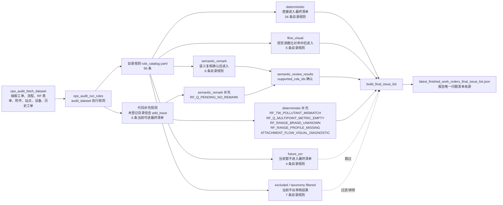

# 运维工单审核规则启用说明图表

来源：

- 规则目录：`backend/app/services/ops_audit/configs/rule_catalog.yaml`
- 分阶段配置：`backend/app/services/ops_audit/configs/rule_review_stages.yaml`
- 最终清单装配：`backend/app/services/ops_audit/final_issue_list.py`
- 规则执行入口：`backend/app/services/ops_work_order_audit_engine.py`

当前口径：

- 目录规则共 56 条。
- 当前可进入 `latest_finished_work_orders_final_issue_list.json` 的规则共 51 条：45 条目录规则 + 6 条代码补充规则。
- `semantic_remark` 规则先进入语义复核，只有 `can_promote_to_final_issue=true` 且命中 `supported_rule_ids` 后才进入最终清单。
- `flow_visual` 规则会调用多模态视觉读数比对，命中后作为确定性附件读数问题进入最终清单。
- `future_ocr` 与 `excluded` 不进入最终清单。
- `FLOW_*` 和 `LIFECYCLE_*` 虽然部分还在目录或执行函数中，但会被 `rule_taxonomy.is_excluded_rule()` 过滤，不进入当前审核结果。

## 直接进入最终清单的目录规则（34 条）

| 规则 ID | 名称 | 等级 | 范围 |
|---|---|---:|---|
| RF_REQUIRED_FIELD_LOW_VALUE | RF 表单关键字段为空或低价值 | 中 | RF_* |
| RF_ENV_TEMP_HUMIDITY_EMPTY | RF 表单室内温湿度未填 | 中 | RF_* |
| RF_PERSONNEL_VEHICLE_FORMAT_LOW_VALUE | 每周巡检汇总表人员或车辆填写不规范 | 中 | RF_W_INSPECTIONSUMMARY |
| RF_STATION_MISMATCH | RF 表单站点与工单站点不一致 | 高 | working_orders/RF_* |
| RF_CHECK_TIME_OUTSIDE_RANGE | RF 表单检查时间不在开始结束时间内 | 高 | RF_* |
| RF_RANGE_VALUE_MISSING | RF 表单应检项目检查值为空 | 高 | RF_W_GASEOUSCHECK_CO/NOX/O3/SO2、RF_W_PMCHECK |
| RF_RANGE_BY_GAS_TYPE_MISMATCH | RF 表单气体类型与量程不匹配 | 高 | RF_W_GASEOUSCHECK_* |
| RF_UNIT_MISMATCH | RF 表单单位与数值量级不匹配 | 中 | RF_M_GASEOUSFLOWCHECK |
| RF_PM_MEMBRANE_ERROR_MISMATCH | 颗粒物校准膜误差复算不一致 | 高 | RF_Q_PM10RUNSTATUSCHECK/RF_Q_PM25RUNSTATUSCHECK |
| RF_PM_MEMBRANE_ERROR_OUT_OF_RANGE | 颗粒物校准膜误差超出 +/-2% | 高 | RF_Q_PM10RUNSTATUSCHECK/RF_Q_PM25RUNSTATUSCHECK |
| RF_RANGE_OUT_OF_SPEC | RF 表单检查值超出正常范围 | 高 | 周检气态、周检颗粒物、月度气体流量 |
| RF_M_GASEOUSFLOWCHECK_ERROR_OUT_OF_RANGE | 月度气体流量检查测量误差超出 +/-10% | 高 | RF_M_GASEOUSFLOWCHECK |
| RF_FIELD_POSITION_SUSPECT | RF 表单字段位置疑似错填 | 中 | RF_M_GASEOUSFLOWCHECK/RF_TW_PmFlowCheck/RF_Q_GaseousFlowCheck |
| RF_MULTIPOINT_RANGE_INVALID | 多点校准量程较上一条同站点同类表单发生变化 | 高 | RF_HY_O3VALUEPASS/RF_Q_GASEOUSMULTIPOINT_* |
| RF_CALIBRATION_DATE_EXPIRED | RF 表单校准有效期异常 | 高 | RF_Q_GaseousFlowCheck/RF_TW_PmFlowCheck/RF_TW_PmFlowCalibrate/RF_Q_GASEOUSMULTIPOINT_* |
| RF_CALIBRATION_INTERVAL_TOO_LONG | RF 表单校准周期超过两年 | 高 | RF_Q_GaseousFlowCheck/RF_TW_PmFlowCheck/RF_TW_PmFlowCalibrate/RF_Q_GASEOUSMULTIPOINT_* |
| RF_REFERENCE_FLOWMETER_CERT_DATE_MISMATCH | 月度气态流量检查参考流量计证书日期不一致 | 高 | RF_M_GASEOUSFLOWCHECK/WO_COMMONFILE |
| ATTACHMENT_O3_VALUE_PASS_XLS_VALUE_MISMATCH | O3 量值传递 XLS 附件数据与表单不一致 | 高 | RF_HY_O3VALUEPASS/WO_COMMONFILE |
| RF_ENUM_VALUE_INVALID | RF 表单枚举字段取值异常 | 高 | RF_W_OTHERDEVICECHECK/RF_TW_PmFlowCalibrate |
| RF_POLLUTANT_TYPE_MISMATCH | RF 表单污染物类型与表名不一致 | 高 | RF_W_GASEOUSCHECK_*/RF_Q_GASEOUSMULTIPOINT_* |
| RF_Q_GASEOUSFLOWCHECK_PRESSURE_TRUE_VALUE_MISMATCH | 季度气体流量检查气压真实值复算不一致 | 高 | RF_Q_GaseousFlowCheck |
| RF_VISIBILITY_NO_DEVICE_FIELD_CONFLICT | 能见度无设备说明与设备字段冲突 | 高 | RF_HY_VISIBILITYCALI/Sup_RF_NepheloMeterCalibration/Sup_RF_MonthNepheloMeterCheck |
| RF_HY_ENV_HUMIDITY_SENSOR_VALUE_MISSING | 半年环境湿度校准传感器读数未填 | 高 | RF_HY_EnvironmentHumidity |
| RF_HY_ENV_HUMIDITY_BEFORE_AFTER_UNCHANGED_SUSPECT | 半年环境湿度校准前后读数未变化 | 中 | RF_HY_EnvironmentHumidity |
| RF_HY_ENV_HUMIDITY_CALIBRATION_DATE_INVALID | 半年环境湿度上次校准日期异常 | 中 | RF_HY_EnvironmentHumidity |
| RF_PM_PRESSURE_UNIT_MISMATCH | 颗粒物气压字段单位或量级异常 | 高 | RF_Q_PMPRESSURE |
| RF_PM_PRESSURE_ERROR_MISMATCH | 颗粒物气压误差复算不一致 | 高 | RF_Q_PMPRESSURE |
| RF_PM_TEMP_ERROR_MISMATCH | 颗粒物温度误差复算不一致 | 高 | RF_Q_PMPRESSURE |
| RF_PM_TEMP_ERROR_OUT_OF_RANGE | 颗粒物温度误差超出 +/-2 degC | 高 | RF_Q_PMPRESSURE |
| RF_PM_PRESSURE_ERROR_OUT_OF_RANGE | 颗粒物气压误差超出 +/-1kPa | 高 | RF_Q_PMPRESSURE |
| RF_PM_TEMP_PRESSURE_ERROR_UNRECALCULABLE | 颗粒物温度/气压误差无法复算 | 中 | RF_Q_PMPRESSURE |
| RF_DEVICE_IDENTITY_INCONSISTENT | 跨工单设备身份疑似不一致 | 中 | working_orders/RF_*/base_device/device_history |
| ATTACHMENT_REQUIRED_MISSING | 必需附件缺失 | 高 | working_orders/RF_*/wo_commonfile_links/WO_COMMONFILE |

## 语义复核确认后进入最终清单的目录规则（6 条）

| 规则 ID | 名称 | 等级 | 范围 |
|---|---|---:|---|
| RF_PM_TAPE_USAGE_INVALID | 颗粒物周检纸带使用量填写不规范 | 中 | RF_W_PMCHECK |
| RF_TW_REMARK_LOW_VALUE | 两周切割头清洗缺少照片且备注说明待复核 | 中 | RF_TW_CleanCuttingHead |
| RF_ABNORMAL_VALUE_NO_REMARK | RF 表单异常值无说明 | 中 | RF_* |
| RF_NO_DEVICE_WITHOUT_REMARK | 其他设备无对应设备但说明不清 | 中 | RF_W_OTHERDEVICECHECK |
| REMARK_SEMANTIC_INCOMPLETE | 备注未说明原因/措施/结果 | 高 | working_orders/working_order_details/RF_* |
| ATTACHMENT_STATION_MAINTAIN_PHOTO_SEMANTIC_MISSING | 站点设备维护现场照片文件名语义待复核 | 中 | RF_M_STATIONDEVICEMAINTAIN/WO_COMMONFILE |

## 视觉读数比对规则（5 条）

| 规则 ID | 名称 | 等级 | 范围 |
|---|---|---:|---|
| ATTACHMENT_PM_FLOW_CALIBRATION_VALUE_MISMATCH | 颗粒物流量校准照片读数与表单值不一致 | 高 | RF_TW_PmFlowCalibrate |
| ATTACHMENT_GAS_FLOW_DISPLAY_VALUE_MISMATCH | 气体流量检查照片仪器显示值与表单值不一致 | 高 | RF_M_GASEOUSFLOWCHECK/RF_Q_GaseousFlowCheck |
| ATTACHMENT_GAS_FLOW_MEASURED_VALUE_MISMATCH | 气体流量检查照片流量计测量值与表单值不一致 | 高 | RF_M_GASEOUSFLOWCHECK |
| ATTACHMENT_PM_MEMBRANE_VALUE_MISMATCH | 颗粒物校准膜照片读数与表单值不一致 | 高 | RF_Q_PM10RUNSTATUSCHECK/RF_Q_PM25RUNSTATUSCHECK |
| ATTACHMENT_PM_TEMP_PRESSURE_VALUE_MISMATCH | 颗粒物温度压力照片读数与表单值不一致 | 高 | RF_Q_PMPRESSURE |

## 代码补充规则（6 条）

这些规则当前由代码 `add_issue` 产生，但没有登记在 `rule_catalog.yaml`。除语义规则外，因没有配置到 `future_ocr` 或 `excluded`，会按默认 `deterministic` 进入最终清单。

| 规则 ID | 当前阶段 | 说明 |
|---|---|---|
| RF_TW_POLLUTANT_MISMATCH | deterministic | 两周切割头清洗表污染物类型与设备类型不一致 |
| RF_Q_MULTIPOINT_METRIC_EMPTY | deterministic | 多点校准关键指标 `XL/JU/XGXS` 为空 |
| RF_RANGE_BRAND_UNKNOWN | deterministic | 仪器品牌无法匹配范围配置 |
| RF_RANGE_PROFILE_MISSING | deterministic | 已识别品牌但缺少对应字段正常范围配置 |
| ATTACHMENT_FLOW_VISUAL_DIAGNOSTIC | deterministic | 流量照片视觉识别未成功执行的诊断问题 |
| RF_Q_PENDING_NO_REMARK | semantic_remark | 多点校准结果待定/不合格但无说明，语义确认后进入 |

## 当前不进入最终问题清单的规则

| 阶段 | 规则 ID | 原因 |
|---|---|---|
| future_ocr | ATTACHMENT_CERT_INCOMPLETE | 证书完整性 OCR 当前暂不进入最终清单 |
| future_ocr | ATTACHMENT_WATERMARK_INCOMPLETE | 照片水印 OCR 当前暂不进入最终清单 |
| future_ocr | REPORT_TOC_NOT_UPDATED | 报告目录 OCR 当前暂不进入最终清单 |
| future_ocr | ATTACHMENT_REPORT_MISSING | 报告缺失候选当前暂不进入最终清单 |
| taxonomy filtered | FLOW_MISSING | `FLOW_*` 被统一过滤 |
| taxonomy filtered | FLOW_NO_CREATE | `FLOW_*` 被统一过滤 |
| taxonomy filtered | FLOW_NO_CHECK | `FLOW_*` 被统一过滤 |
| taxonomy filtered | LIFECYCLE_FINISH_NEAR_DEADLINE | `LIFECYCLE_*` 被统一过滤 |
| taxonomy filtered | LIFECYCLE_FINISH_WITHOUT_EFFECTIVE_CLOSURE | `LIFECYCLE_*` 被统一过滤 |
| excluded/taxonomy filtered | RF_AUDITOR_EMPTY | 审批人为空当前排除 |
| excluded/taxonomy filtered | RF_VALUE_FORMULA_MISMATCH | 通用公式不一致当前排除，专项公式规则仍启用 |
